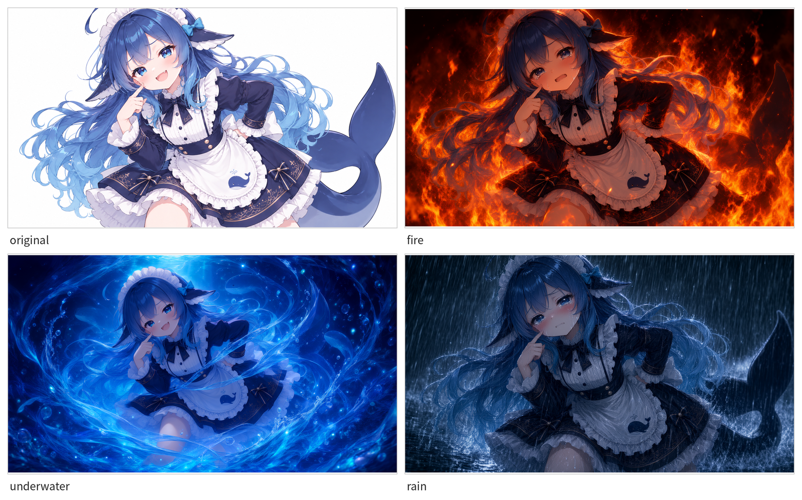
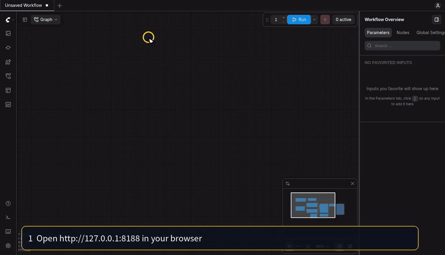
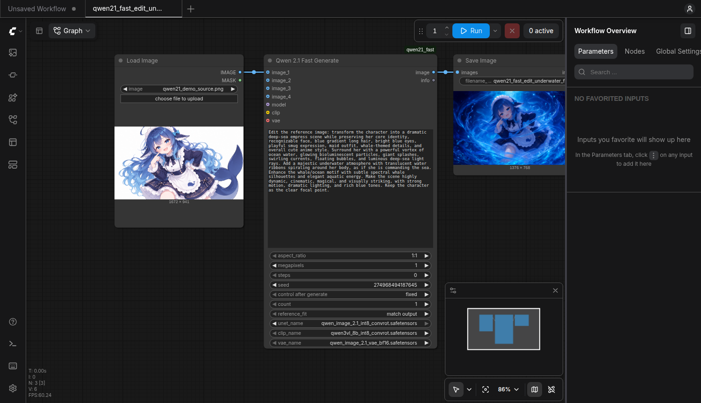

**Japanese → [README.md](README.md)**

# Running Qwen-Image-2.1 on a 12GB GPU with ComfyUI (notes from a beginner)



*The same source image (top left) and 3 edits of it: fire, underwater, rain.*

**About the source image:** It was generated separately from this demo, with AI, based on the “DeepSeek girl” meme.
It is not an unauthorized use of an illustrator's existing artwork.

> [!NOTE]
> **These are notes from a beginner.** I wrote down the steps that worked on my own PC.
> I hope they help others trying the same thing, but **I cannot guarantee they will work for you**.
> If you spot an issue, tell me on X at [@\_ryu15\_](https://x.com/_ryu15_) or in a repository issue.

Whether you already use ComfyUI or are installing it now, this guide adds **one node** for image generation and editing.
You do not have to write Python yourself.

The official quantized weights take about 17GB.
On my 12GB RTX 4070, a 1024×1024 image took about 10 seconds and a 2048×2048 image about 90 seconds.

> [!WARNING]
> **These instructions assume Linux (verified on Ubuntu 24.04).** Windows / macOS will not work as-is.
> See [Requirements](#requirements) and [10-3. OS notes](TECHNICAL.en.md#10-3-os-notes).

## Table of contents

<details>
<summary>Show chapters</summary>

- [Requirements](#requirements)
- [1. Quick start](#1-quick-start)
  - [1-1. Install](#1-1-install)
  - [1-2. Verify](#1-2-verify)
  - [1-3. Open and run a workflow](#1-3-open-and-run-a-workflow)
- [2. Let an AI agent do the setup](#2-let-an-ai-agent-do-the-setup)
- [3. Editing examples and settings](#3-editing-examples-and-settings)
- [Technical reference (internals, measurements, troubleshooting, development)](TECHNICAL.en.md)

</details>

## Requirements

| Item | Conditions verified in this repository |
|---|---|
| OS | **Linux** (verified on Ubuntu 24.04) |
| GPU | Measured on an **RTX 4070 12GB**. A fresh install needs an NVIDIA driver (**580 or newer**, because `--with-comfyui` installs CUDA 13 builds of PyTorch) and `nvidia-smi`. This is not a claim that 12GB is a universal minimum |
| ComfyUI | **0.37 or newer** if you already have it (`TextEncodeQwenImage21` is required). The script fetches ComfyUI if you do not |
| Python | `python3` **3.10 or newer**. A fresh install also needs `venv` |
| Git | The `git` command is required |
| Hugging Face CLI | Existing ComfyUI users need `hf` ([installation guide](https://huggingface.co/docs/huggingface_hub/installation#install-the-hugging-face-cli)). A fresh install adds it to the new virtual environment automatically |
| Disk | About 17GB for the weights plus room for ComfyUI and PyTorch. Placing the model store and ComfyUI on different filesystems needs additional space for copies |

On Ubuntu, if `git` or Python is missing, install them with `sudo apt install git python3 python3-venv` first.

The default ComfyUI location is `~/ComfyUI`. If an existing installation lives elsewhere, pass `COMFY=/path/to/ComfyUI`.
For a fresh install, the script creates `~/ComfyUI/.venv`. You do not need to rebuild the environment of an existing ComfyUI.

## 1. Quick start

### 1-1. Install

First, get this repository:

```bash
git clone https://github.com/kuraneko1/qwen21-fast-comfyui.git
cd qwen21-fast-comfyui
```

#### A. If you already have ComfyUI

Run this with ComfyUI 0.37 or newer and the `hf` command available:

```bash
./install.sh --dry-run    # show planned actions without changing files
./install.sh              # download ~17GB of weights and install
```

If ComfyUI is somewhere other than `~/ComfyUI`:

```bash
COMFY=/path/to/ComfyUI ./install.sh
```

In that case, use the same location when verifying: `COMFY_DIR=/path/to/ComfyUI python3 test_qwen21.py t2i_1mp`.

If it ends with `RESTART REQUIRED`, restart ComfyUI using your usual method.
If it restarted ComfyUI automatically, continue to the next step.

#### B. If you do not have ComfyUI yet

On Ubuntu-family Linux with an NVIDIA GPU, install ComfyUI and this project together:

```bash
./install.sh --with-comfyui --dry-run   # show planned actions without changing files
./install.sh --with-comfyui             # install ComfyUI, its environment, weights, and node
```

If `~/ComfyUI` already exists, use A above. B stops with an error instead of touching an existing folder.
If a download is interrupted, rerun the same command.

When installation finishes, start ComfyUI in a **second terminal**:

```bash
cd ~/ComfyUI
.venv/bin/python main.py
```

Both A and B install the three weight files, the custom node, three workflows, and the demo source image into ComfyUI.
Once ComfyUI starts, return to the first terminal (in this repository) for the next step.

### 1-2. Verify

```bash
./check.sh                       # syntax checks (does not generate images)
python3 test_qwen21.py t2i_1mp   # generate one image first
```

Run this while ComfyUI is running. Success ends with `1/1 ok`.
To check all five cases, including editing, run `python3 test_qwen21.py` without arguments.

<details>
<summary>See the five-case output from my machine</summary>

The full test reuses its first generated image as the reference for editing.
It works even if you have never prepared an image yourself.

```
t2i_1mp            success  exec=  13.6s wall=  14.0s qwen21_test_t2i_1mp_00001_.png
t2i_16x9_2mp       success  exec=  30.7s wall=  31.0s qwen21_test_t2i_16x9_2mp_00001_.png
t2i_1mp_count3     success  exec=  24.2s wall=  25.0s qwen21_test_t2i_1mp_count3_00001_.png, ...
edit_match_output  success  exec=  15.9s wall=  16.1s qwen21_test_edit_match_output_00001_.png
edit_keep_size     success  exec=  16.7s wall=  17.0s qwen21_test_edit_keep_size_00001_.png

5/5 ok
```

</details>

### 1-3. Open and run a workflow

For a quick check of the ComfyUI interface, open and run the **fixed-seed underwater workflow**.
The editing examples and their settings are explained separately in [3. Editing examples and settings](#3-editing-examples-and-settings).

1. Open <http://127.0.0.1:8188> in your browser.
2. Click the **Workflows** icon on the left edge of the screen.
3. Under **Browse**, choose `qwen21_fast_edit_underwater_fixed`.
4. Click the blue **Run** button at the top. The result appears in **Save Image** on the right.

The underwater demo takes about 20 seconds on my machine.
The PNG is saved in `~/ComfyUI/output/` (or `output/` under your own ComfyUI location).

This short recording shows those exact clicks. Follow the yellow cursor ([MP4 version](docs/demo/open_workflow_en.mp4)).



| What you want to do | Workflow to open |
|---|---|
| Generate from text | `qwen21_fast_t2i` — write a prompt, then run |
| Make a different underwater girl from the source image each time | `qwen21_fast_edit` — random seed |
| Reproduce the girl from the video | `qwen21_fast_edit_underwater_fixed` — seed `274968494187645` is fixed |

Both editing workflows already include the girl as the source and the underwater prompt.
To use your own image, choose it in the **Load Image** node on the left (click **choose file to upload**, or drag an image file onto the node).
A second run of the fixed workflow with identical settings shows the cached result.

<details>
<summary>See the text-to-image screen, result, and generation recording</summary>

Here is `qwen21_fast_t2i` when opened:


After you enter a prompt and run it, the result appears on the right.


Here is the image generated by that run:


Here is the generation in progress (about 20 seconds). An [MP4 version](docs/demo/generation.mp4) is available too.


</details>

For port changes or access from another device on your LAN, see [10-5. Ports and connection](TECHNICAL.en.md#10-5-ports-and-connection).

## 2. Let an AI agent do the setup

If you are using ChatGPT, Claude, a local agent, or another tool that can operate your machine, copy the instructions below and paste them into it.

```
I want to set up ComfyUI and Qwen-Image-2.1 using the steps in this repository.
https://github.com/kuraneko1/qwen21-fast-comfyui

What I want you to do:
1. git clone the repository above
2. If ComfyUI is already installed, run ./install.sh --dry-run, then ./install.sh.
   Otherwise, run ./install.sh --with-comfyui --dry-run, then ./install.sh --with-comfyui
   (it downloads about 17GB of weights, so it takes a while)
3. Run ./check.sh for the syntax checks
4. Start or restart ComfyUI and run python3 test_qwen21.py to test generation
   (5/5 ok means it worked)
5. If something fails or you need the internals, read TECHNICAL.en.md

Assumptions: Ubuntu-family Linux, an NVIDIA GPU, git, and Python 3.10 or newer.
If an existing ComfyUI is elsewhere, run install.sh with COMFY=/path/to/ComfyUI in front of it.
If there is anything you are unsure about, ask me before you run it.
```

## 3. Editing examples and settings

Connect a reference image to `image_1` to enter edit mode.
In this example, the character's face, outfit, and art style remain while the surroundings change.

`qwen21_fast_edit_underwater_fixed` includes the source image and underwater prompt shown below.
Its seed is fixed at `274968494187645`, so running it reproduces the example.
For a new result each time, open `qwen21_fast_edit`.

The central "Qwen 2.1 Fast Generate" node edits when `image_1` is connected.
Without a reference, it generates from text.



LoadImage on the left supplies the source; `prompt` in the middle describes the edit; Save Image on the right shows the result. Disconnect `image_1` to use the same node for text-to-image.

| | scene | seed |
|---|---|---|
| original | a character illustration on a white background (1672x941) | — |
| 1 fire | clothes and surroundings engulfed in flames | 1030019892377945 |
| 2 underwater | water spiraling around her like a deep-sea empress | 274968494187645 |
| 3 rain | struck by torrential rain | 73346377262621 |

**To reproduce the fire and rain scenes**: only the underwater demo ships as a fixed-seed workflow. Open `qwen21_fast_edit`, put the value above into `seed`, set **control after generate to `fixed`** and run it - with `randomize` you get a different image every time.

#### Original image


#### 1. Fire


<details>
<summary>Full fire prompt</summary>

```text
Edit the reference image: keep the character clearly recognizable while placing her in a dramatic scene where her clothing and the space around her are engulfed in intense flames. Preserve her core identity, recognizable face, long blue gradient hair, blue eyes, maid outfit, whale-themed details, and overall anime style. Change her expression so that she looks slightly teary and on the verge of crying, with watery eyes and a distressed, trembling expression, while still remaining cute and expressive.

Add vivid fire surrounding her body, sleeves, skirt, and the air around her, with bright orange flames, glowing embers, smoke, sparks, heat distortion, and strong cinematic fire lighting. The flames should look powerful and visually striking, but do not show gore, injuries, or graphic burns. Keep the character as the clear focal point. Highly detailed, dramatic, emotional, and visually impactful.
```

</details>

#### 2. Underwater


<details>
<summary>Full underwater prompt</summary>

```text
Edit the reference image: transform the character into a dramatic deep-sea empress scene while preserving her core identity, recognizable face, blue gradient long hair, bright blue eyes, playful smug expression, maid outfit, whale-themed details, and overall cute anime style. Surround her with a powerful vortex of ocean water, glowing bioluminescent particles, giant splashes, swirling currents, floating bubbles, and luminous deep-sea light rays. Add a majestic underwater atmosphere with translucent water ribbons spiraling around her body, as if she is commanding the sea. Enhance the whale/ocean motif with subtle spectral whale silhouettes and elegant aquatic energy. Make the scene highly dynamic, cinematic, magical, and visually striking, with strong motion, dramatic lighting, and rich blue tones. Keep the character as the clear focal point.
```

</details>

#### 3. Rain


<details>
<summary>Full rain prompt</summary>

```text
Edit the reference image: place the character in an intense torrential rainstorm while preserving her core identity, recognizable face, long blue gradient hair, blue eyes, maid outfit, whale-themed details, and overall cute anime style. Change her expression slightly so that she looks teary and on the verge of crying, with watery eyes, a trembling mouth, and a sad, distressed but still cute expression.

Add extremely heavy pouring rain throughout the scene, with dense rain streaks, splashing water, mist, droplets, wet hair, soaked clothing, puddles, and strong storm atmosphere. Make it look like she is being struck by a violent downpour. Add visible rain in the foreground and background, dramatic water splashes, wet shine on the outfit, and cinematic storm lighting. Her hair and clothes should appear drenched and slightly affected by wind and rain, while keeping her original design clearly recognizable.

Make the final result highly detailed, emotional, cinematic, and visually striking. No gore, no injury, no burial, no extra characters. Keep the character as the clear focal point.
```

</details>

**Settings (common to all three)**: the reference is 1672x941 and the output is **1376x768** (same aspect ratio, 1 MP of area).
`aspect_ratio` 1:1 / `megapixels` 1 / `steps` 0 (auto = 12 steps) / `reference_fit` `match output` /
cfg 1.0 / euler simple. About **20 s per image** (RTX 4070 12GB, model resident; → [6. Measured numbers](TECHNICAL.en.md#6-measured-numbers)).

**Prompt tips** (what these 3 images taught me)

1. **Name what must stay** - list `core identity, recognizable face, long blue gradient hair, blue eyes,
   maid outfit, whale-themed details, and overall anime style`. This is what decides whether it still looks
   like the same character
2. **An expression change is something you ask for** - fire and rain say `teary, on the verge of crying`,
   underwater says `playful smug expression`. You can steer the face deliberately while keeping the identity
3. **Write the environment in scene words** - `intense flames` / `vortex of ocean water` / `torrential
   rainstorm`, plus light (`cinematic lighting`) and motion (`swirling currents`)
4. **Say what must not happen** - `no gore, no injury, no burial, no extra characters`. Worth including so a
   viewer cannot misread the image
5. **To hold the framing, state the preservation explicitly** - environment words also move the composition
   (measured: a version that only said "flames rising in a meadow" pushed the top of the head from 2% to
   10% down the frame and widened the crop to the waist). For an exactly fixed frame, mask (inpaint) the
   background instead; this node has no mask input

The CLI equivalent:

```bash
python3 test_qwen21_edit.py docs/demo/source.png "$(cat docs/demo/underwater.txt)" 1 --seed 274968494187645
```

To try your own image, for example: `python3 test_qwen21_edit.py photo.png "make it snow, keep the subject unchanged"`.

---

**That is the end of the material needed for normal installation, generation, and editing.**

Internal architecture, model placement, node implementation, measurements, troubleshooting, manual installation, and development notes are in [TECHNICAL.en.md](TECHNICAL.en.md).
