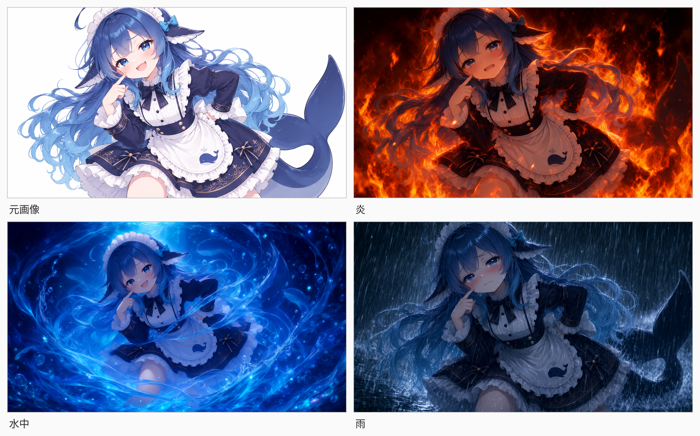
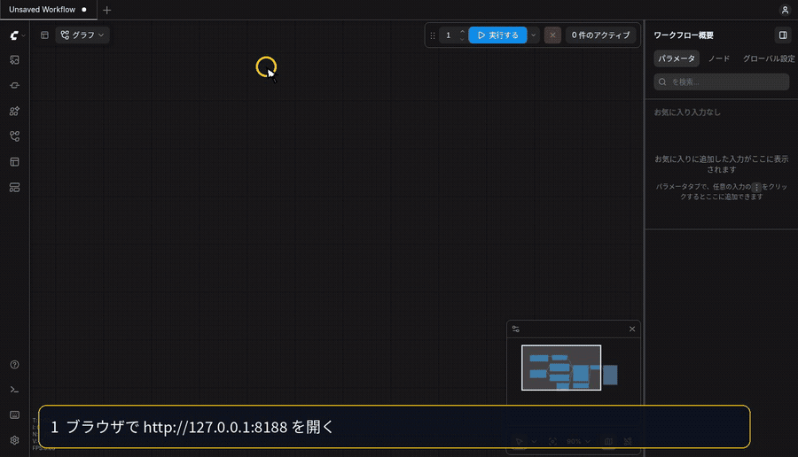
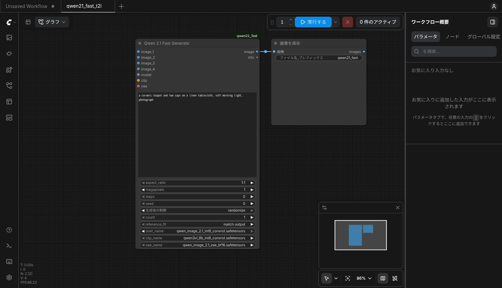
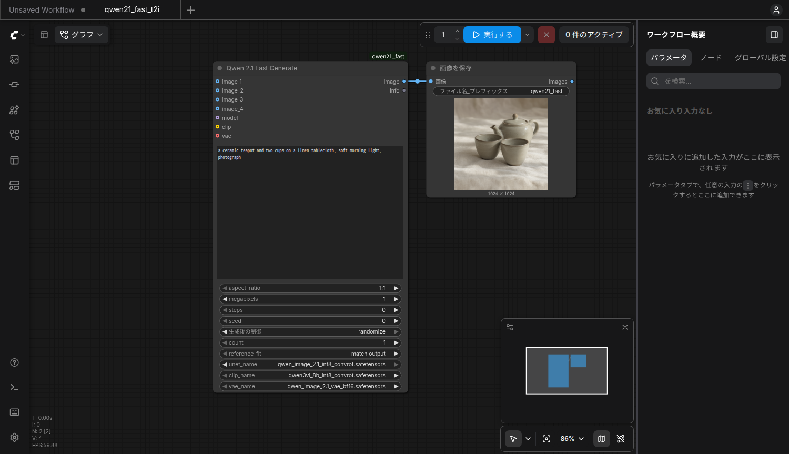
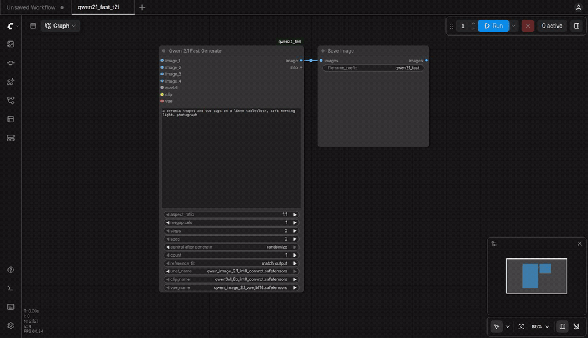
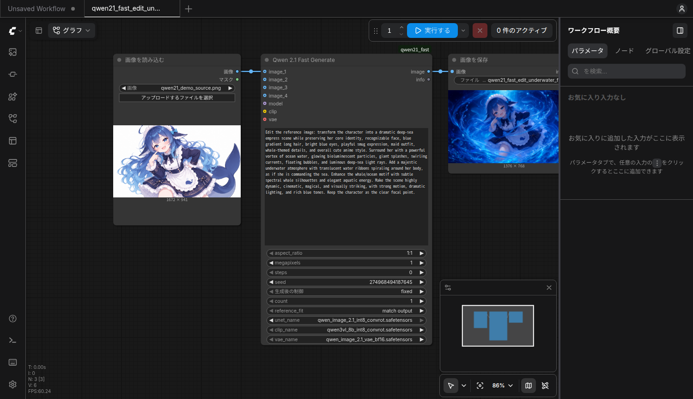

**English → [README.en.md](README.en.md)**

# 12GBのGPUで Qwen-Image-2.1 を ComfyUI で動かす（初心者の備忘録）



*同じ元画像を編集し、周囲のシーンを変えた3枚です。*

**元画像について:** 「DeepSeek娘」ミームをもとに、このデモとは別にAIで生成された画像です。
イラストレーターの既存作品を無断で使ったものではありません。

> [!NOTE]
> **初心者の備忘録です。** 自分のPCで動いた手順を残しています。
> 同じことを試す方の参考になれば嬉しいですが、**動作保証はありません**。
> 気づいた点は X の [@\_ryu15\_](https://x.com/_ryu15_) か、このリポジトリの issue で教えてください。

ComfyUIをすでに使っている人も、これから入れる人も、**ノードを1個**追加して画像生成と編集を試せます。
Pythonを自分で書く必要はありません。

公式の量子化済み重みは約17GBです。
私のRTX 4070 12GBでは、1024×1024を約10秒、2048×2048を約90秒で生成できました。

> [!WARNING]
> **この手順はLinux（Ubuntu 24.04で確認）前提です。** Windows / macOS はそのままでは動きません。
> 詳しくは [前提条件](#前提条件) と [10-3. OS別の注意](TECHNICAL.md#10-3-os別の注意) を参照してください。

## 目次

<details>
<summary>章一覧を開く</summary>

- [前提条件](#前提条件)
- [1. クイックスタート](#1-クイックスタート)
  - [1-1. インストール](#1-1-インストール)
  - [1-2. 動作確認](#1-2-動作確認)
  - [1-3. ワークフローを開いて実行する](#1-3-ワークフローを開いて実行する)
- [2. AIエージェントにセットアップを任せる](#2-aiエージェントにセットアップを任せる)
- [3. 画像編集の作例と設定](#3-画像編集の作例と設定)
- [技術リファレンス（内部構成・実測・トラブルシューティング・開発）](TECHNICAL.md)

</details>

## 前提条件

| 項目 | このリポジトリで確認している条件 |
|---|---|
| OS | **Linux**（Ubuntu 24.04で確認） |
| GPU | **RTX 4070 12GB**で実測。新規導入ではNVIDIAドライバーと `nvidia-smi` が必要です。12GBを普遍的な最小要件とは断定しません |
| ComfyUI | 既存のものを使うなら**0.37以降**（`TextEncodeQwenImage21` が必要）。未導入ならスクリプトが取得します |
| Python | **3.10以降**の `python3`。新規導入では `venv` も必要です |
| Git | `git` コマンドが必要です |
| Hugging Face CLI | 既存のComfyUIを使う場合は `hf` が必要（[導入方法](https://huggingface.co/docs/huggingface_hub/installation#install-the-hugging-face-cli)）。新規導入では専用の仮想環境へ自動で入れます |
| ディスク | 重み約17GBに加え、ComfyUI・PyTorch用の空き容量が必要です。モデルとComfyUIが別ファイルシステムなら重みのコピー分も必要です |

Ubuntuで `git` やPythonがない場合は、先に `sudo apt install git python3 python3-venv` で用意してください。

ComfyUIの既定の場所は `~/ComfyUI` です。既存のものが別の場所にあるなら `COMFY=/path/to/ComfyUI` を指定できます。
新規導入ではスクリプトが `~/ComfyUI/.venv` を作ります。既存のComfyUI用に仮想環境を作り直す必要はありません。

## 1. クイックスタート

### 1-1. インストール

まず、このリポジトリを取得します。

```bash
git clone https://github.com/kuraneko1/qwen21-fast-comfyui.git
cd qwen21-fast-comfyui
```

#### A. ComfyUIがすでにある場合

ComfyUI 0.37以降と `hf` コマンドが使える環境で実行します。

```bash
./install.sh --dry-run    # 変更せず、実行予定を表示
./install.sh              # 重み約17GBをダウンロードして導入
```

ComfyUIが `~/ComfyUI` 以外にある場合:

```bash
COMFY=/path/to/ComfyUI ./install.sh
```

その場合、動作確認にも同じ場所を指定します: `COMFY_DIR=/path/to/ComfyUI python3 test_qwen21.py t2i_1mp`。

最後に `RESTART REQUIRED` と出たら、ComfyUIをいつもの方法で再起動してください。
自動で再起動された場合は、そのまま次へ進めます。

#### B. ComfyUIがまだない場合

Ubuntu系LinuxとNVIDIA GPUの環境で、ComfyUI本体からまとめて導入します。

```bash
./install.sh --with-comfyui --dry-run   # 変更せず、実行予定を表示
./install.sh --with-comfyui             # ComfyUI・仮想環境・重み・ノードを導入
```

`~/ComfyUI` がすでにある場合は上のAを使ってください。Bは既存のフォルダを上書きしません。
途中で通信が切れた場合は、同じコマンドを再実行できます。

導入が終わったら、**別のターミナル**でComfyUIを起動します。

```bash
cd ~/ComfyUI
.venv/bin/python main.py
```

A・Bのどちらでも、重み3ファイル・カスタムノード・ワークフロー3つ・デモの元画像が配置されます。
ComfyUIが起動したら、最初のターミナル（このリポジトリのフォルダ）で次へ進みます。

### 1-2. 動作確認

```bash
./check.sh                       # 構文チェック（画像生成はしません）
python3 test_qwen21.py t2i_1mp   # まず1枚生成する
```

ComfyUIが起動している状態で実行してください。成功すると `1/1 ok` と出ます。
画像編集も含む5ケースを確認したい場合は、引数なしで `python3 test_qwen21.py` を実行します。

<details>
<summary>5ケースの実行例を見る</summary>

引数なしのテストは、最初に生成した画像を編集テストの参照画像として使います。
まだ画像を1枚も用意していなくても実行できます。

```
t2i_1mp            success  exec=  13.6s wall=  14.0s qwen21_test_t2i_1mp_00001_.png
t2i_16x9_2mp       success  exec=  30.7s wall=  31.0s qwen21_test_t2i_16x9_2mp_00001_.png
t2i_1mp_count3     success  exec=  24.2s wall=  25.0s qwen21_test_t2i_1mp_count3_00001_.png, ...
edit_match_output  success  exec=  15.9s wall=  16.1s qwen21_test_edit_match_output_00001_.png
edit_keep_size     success  exec=  16.7s wall=  17.0s qwen21_test_edit_keep_size_00001_.png

5/5 ok
```

</details>

### 1-3. ワークフローを開いて実行する

ここではComfyUI上での操作確認として、**固定seedの水中ワークフロー**を開いて実行します。
画像編集の作例や設定そのものは [3. 画像編集の作例と設定](#3-画像編集の作例と設定) でまとめて説明します。

1. ブラウザで <http://127.0.0.1:8188> を開きます。
2. 画面左端の**ワークフロー**アイコンを押します。
3. **ブラウズ**から `qwen21_fast_edit_underwater_fixed` を選びます。
4. 画面上部の青い**実行する**ボタンを押します。完成画像は右側の**画像を保存**に表示されます。

私の環境では水中デモの生成に約20秒かかります。
PNGファイルは `~/ComfyUI/output/` に保存されます（ComfyUIを別の場所に置いた場合は、その `output/`）。

下はこの操作を実際に収録した短い動画です。黄色いカーソルを追ってください（[MP4版](docs/demo/open_workflow_ja.mp4)）。



| やりたいこと | 開くワークフロー |
|---|---|
| テキストから作る | `qwen21_fast_t2i` — プロンプトを書いて実行 |
| 元画像から水中の娘を毎回違う絵で作る | `qwen21_fast_edit` — seedはランダム |
| 動画と同じ水中の娘を再現する | `qwen21_fast_edit_underwater_fixed` — seed `274968494187645` で固定 |

画像編集の2つには、女の子の元画像と水中のプロンプトが最初から入っています。
自分の画像を使うときだけ、左側の**画像を読み込む**ノードで選び直します。
固定版を同じ設定で再実行すると、キャッシュされた結果が表示されます。

<details>
<summary>テキストから生成した画面・画像・生成中の動画を見る</summary>

`qwen21_fast_t2i` を開いた画面です。



プロンプトを入力して実行すると、右側に結果が出ます。



実際に生成した画像です。


生成中の画面です（約20秒）。[MP4版](docs/demo/generation.mp4)もあります。



</details>

ポート変更やLAN内の別端末から開く方法は [10-5. ポートと接続先](TECHNICAL.md#10-5-ポートと接続先) を参照してください。

## 2. AIエージェントにセットアップを任せる

環境を操作できるChatGPT / Claude / ローカルエージェントなどに任せたい場合は、下の指示文をコピーして渡せます。

```
このリポジトリの手順で、ComfyUIと Qwen-Image-2.1 を使えるようにしたい。
https://github.com/kuraneko1/qwen21-fast-comfyui

やってほしいこと:
1. 上のリポジトリを git clone する
2. 既存のComfyUIがあれば ./install.sh --dry-run → ./install.sh、なければ
   ./install.sh --with-comfyui --dry-run → ./install.sh --with-comfyui を実行する
   （重みを約17GBダウンロードするので時間がかかる）
3. ./check.sh で構文チェックを実行する
4. ComfyUIを起動または再起動して、python3 test_qwen21.py で生成テストを実行する
   （5/5 ok になれば成功）
5. 問題が起きた場合や内部構成を確認したい場合は TECHNICAL.md を読む

前提: Ubuntu系LinuxとNVIDIA GPU、git、Python 3.10以降。
既存のComfyUIのパスが違う場合は install.sh に COMFY=/path/to/ComfyUI を付ける。
分からないことがあれば、実行前に私に聞いてください。
```

## 3. 画像編集の作例と設定

参照画像を `image_1` に繋ぐと編集モードになります。
この例では、キャラクターの顔・服装・画風を保ったまま周囲を変えています。

`qwen21_fast_edit_underwater_fixed` には、下の元画像と水中のプロンプトが入っています。
seed `274968494187645` も固定済みなので、実行するだけで例を再現できます。
毎回違う結果を見たいときは `qwen21_fast_edit` を開きます。

中央の「Qwen 2.1 Fast Generate」は、`image_1` に画像が繋がっていると編集、
繋がっていないとテキストから生成します。



左のLoadImageが元画像、中央の `prompt` が編集内容、右のSave Imageが完成画像です。`image_1` の線を外すと、同じノードでテキストからの生成に切り替わります。

| | シーン | seed |
|---|---|---|
| 元画像 | 白背景のキャラクター立ち絵（1672×941） | — |
| ① 炎 | 服と周囲が炎に包まれる | 1030019892377945 |
| ② 水中 | 深海の女王のように水が渦を巻く | 274968494187645 |
| ③ 雨 | 豪雨に打たれる | 73346377262621 |

#### 元画像


#### ① 炎


<details>
<summary>炎のプロンプト全文</summary>

```text
Edit the reference image: keep the character clearly recognizable while placing her in a dramatic scene where her clothing and the space around her are engulfed in intense flames. Preserve her core identity, recognizable face, long blue gradient hair, blue eyes, maid outfit, whale-themed details, and overall anime style. Change her expression so that she looks slightly teary and on the verge of crying, with watery eyes and a distressed, trembling expression, while still remaining cute and expressive.

Add vivid fire surrounding her body, sleeves, skirt, and the air around her, with bright orange flames, glowing embers, smoke, sparks, heat distortion, and strong cinematic fire lighting. The flames should look powerful and visually striking, but do not show gore, injuries, or graphic burns. Keep the character as the clear focal point. Highly detailed, dramatic, emotional, and visually impactful.
```

</details>

#### ② 水中


<details>
<summary>海のプロンプト全文</summary>

```text
Edit the reference image: transform the character into a dramatic deep-sea empress scene while preserving her core identity, recognizable face, blue gradient long hair, bright blue eyes, playful smug expression, maid outfit, whale-themed details, and overall cute anime style. Surround her with a powerful vortex of ocean water, glowing bioluminescent particles, giant splashes, swirling currents, floating bubbles, and luminous deep-sea light rays. Add a majestic underwater atmosphere with translucent water ribbons spiraling around her body, as if she is commanding the sea. Enhance the whale/ocean motif with subtle spectral whale silhouettes and elegant aquatic energy. Make the scene highly dynamic, cinematic, magical, and visually striking, with strong motion, dramatic lighting, and rich blue tones. Keep the character as the clear focal point.
```

</details>

#### ③ 雨


<details>
<summary>雨のプロンプト全文</summary>

```text
Edit the reference image: place the character in an intense torrential rainstorm while preserving her core identity, recognizable face, long blue gradient hair, blue eyes, maid outfit, whale-themed details, and overall cute anime style. Change her expression slightly so that she looks teary and on the verge of crying, with watery eyes, a trembling mouth, and a sad, distressed but still cute expression.

Add extremely heavy pouring rain throughout the scene, with dense rain streaks, splashing water, mist, droplets, wet hair, soaked clothing, puddles, and strong storm atmosphere. Make it look like she is being struck by a violent downpour. Add visible rain in the foreground and background, dramatic water splashes, wet shine on the outfit, and cinematic storm lighting. Her hair and clothes should appear drenched and slightly affected by wind and rain, while keeping her original design clearly recognizable.

Make the final result highly detailed, emotional, cinematic, and visually striking. No gore, no injury, no burial, no extra characters. Keep the character as the clear focal point.
```

</details>

**共通の設定**: 参照画像は 1672×941、出力は **1376×768**（参照の縦横比を保ち、面積が1MPになるサイズ）。
`aspect_ratio` 1:1 / `megapixels` 1 / `steps` 0（自動＝12ステップ）/ `reference_fit` `match output` /
cfg 1.0 / euler simple。所要は**1枚あたり約20秒**（RTX 4070 12GB・モデル常駐時。→ [6. 実測値](TECHNICAL.md#6-実測値)）。

**プロンプトのコツ**（この3枚で分かったこと）

1. **残したいものを名指しする** — `core identity, recognizable face, long blue gradient hair, blue eyes,
   maid outfit, whale-themed details, and overall anime style` のように列挙します。ここを書くかどうかで
   「同じキャラに見えるか」が決まります
2. **表情は「変えたい」と書けば変わる** — 炎と雨は `teary, on the verge of crying`、水中は
   `playful smug expression`。同一性を保ったまま表情だけを意図的に振れます
3. **環境はシーンの語で書く** — `intense flames` / `vortex of ocean water` / `torrential rainstorm`。
   光（`cinematic lighting`）と動き（`swirling currents`）も一緒に書くと映えます
4. **やってほしくないことも書く** — `no gore, no injury, no burial, no extra characters`。
   見る人に誤解を与えないためにも入れておきます
5. **画角を保ちたいなら保存条件を明記する** — 環境の語は構図にも効きます（実測: 保存条件を書かずに
   「草原に炎が立ちのぼる」とだけ指定した版は、頭頂部が上端から 2% → 10% になり腰までの広角になりました）。
   厳密に固定したいならマスク（インペイント）で背景だけ描き直します（このノードはマスク入力を持ちません）

CLI から同じ編集をする場合:

```bash
python3 test_qwen21_edit.py docs/demo/source.png "$(cat docs/demo/underwater.txt)" 1 --seed 274968494187645
```

手持ちの画像で試すなら、例えば `python3 test_qwen21_edit.py photo.png "make it snow, keep the subject unchanged"` です。

---

**ここまでで、通常の導入・画像生成・画像編集に必要な説明は終了です。**

内部構成、モデル配置、ノード実装、実測値、トラブルシューティング、手動インストール、開発情報は [TECHNICAL.md](TECHNICAL.md) にまとめています。
