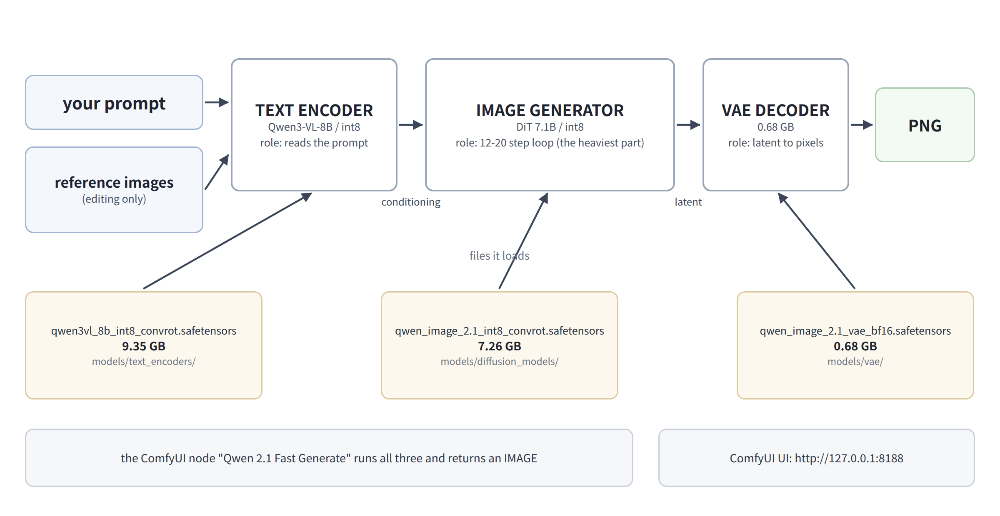
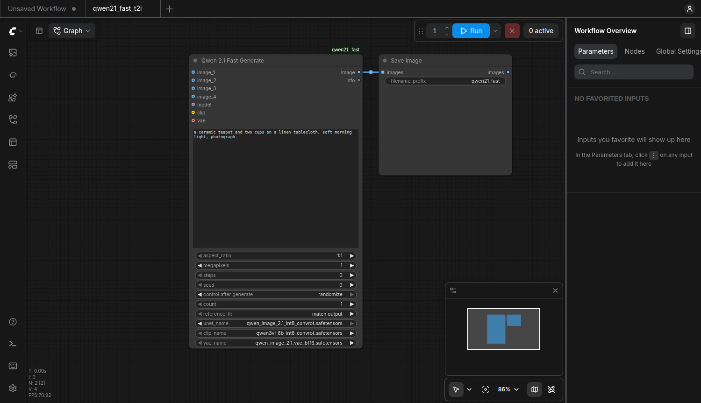
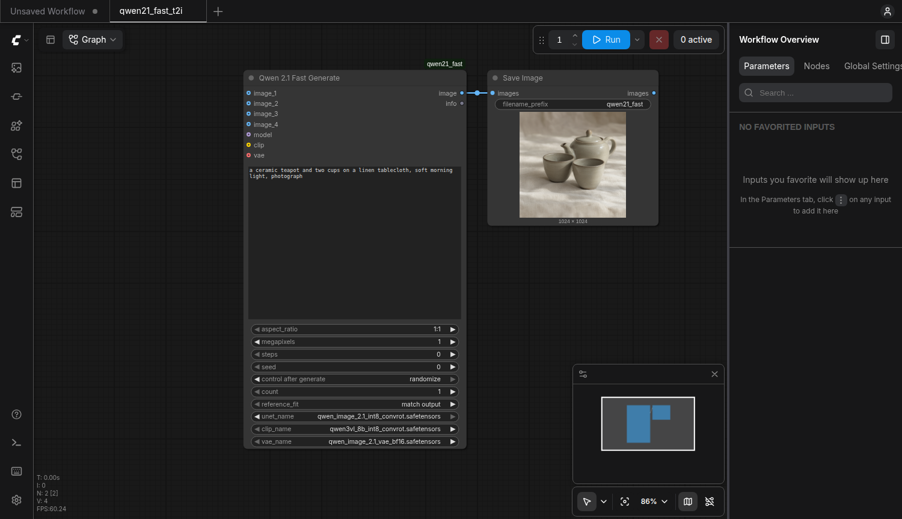

**Japanese → [TECHNICAL.md](TECHNICAL.md)**

**Normal setup and usage → [README.en.md](README.en.md)**

# Technical Reference — Qwen-Image-2.1 / ComfyUI

This file contains the technical material separated from the normal-use README: internal architecture, model files, node implementation, measured performance, troubleshooting, manual setup, and development notes. It is also the best single file to give an AI agent when you want it to inspect, debug, or extend this setup.

<details>
<summary>Show technical contents</summary>

- [4. What is running](#4-what-is-running)
  - [4-1. What the weight files are, and where to get them](#4-1-what-the-weight-files-are-and-where-to-get-them)
  - [4-2. What each piece does](#4-2-what-each-piece-does)
  - [4-3. Exact model names and quantization](#4-3-exact-model-names-and-quantization)
  - [4-4. Editing with reference images](#4-4-editing-with-reference-images)
- [5. Inside the node](#5-inside-the-node)
- [6. Measured numbers](#6-measured-numbers)
- [7. When you want better quality](#7-when-you-want-better-quality)
- [8. Troubleshooting](#8-troubleshooting)
- [9. Things that will bite you](#9-things-that-will-bite-you)
- [10. Manual installation and configuration](#10-manual-installation-and-configuration)
- [11. Development and customization](#11-development-and-customization)
- [12. Files](#12-files)
- [13. License](#13-license)
- [14. Sources](#14-sources)

</details>

## 4. What is running



*The prompt and the reference image flow left to right: text encoder -> image generator -> VAE -> PNG.*

### 4-1. What the weight files are, and where to get them

> [!TIP]
> **You do not have to do this download by hand.** The `install.sh` in the
> [README quick start](README.en.md#1-quick-start) does it for you (that is the fast path).
> This section is for checking what gets downloaded, or for installing by hand.

You need three files, about 17GB in total. Download them with the `hf` command.
See the [official guide](https://huggingface.co/docs/huggingface_hub/installation#install-the-hugging-face-cli) if you need to install the CLI.

```bash
hf download Comfy-Org/Qwen-Image-2.1 diffusion_models/qwen_image_2.1_int8_convrot.safetensors --local-dir ~/qwen-image-2.1-models
hf download Comfy-Org/Qwen-Image-2.1 text_encoders/qwen3vl_8b_int8_convrot.safetensors       --local-dir ~/qwen-image-2.1-models
hf download Comfy-Org/Qwen-Image-2.1 vae/qwen_image_2.1_vae_bf16.safetensors                 --local-dir ~/qwen-image-2.1-models
```

If you would rather grab them with a browser or `curl -L -O`, here are the three direct links.

| purpose | size | download link |
|---|---:|---|
| image generator | 7.26 GB | <https://huggingface.co/Comfy-Org/Qwen-Image-2.1/resolve/main/diffusion_models/qwen_image_2.1_int8_convrot.safetensors> |
| text encoder | 9.35 GB | <https://huggingface.co/Comfy-Org/Qwen-Image-2.1/resolve/main/text_encoders/qwen3vl_8b_int8_convrot.safetensors> |
| VAE | 0.68 GB | <https://huggingface.co/Comfy-Org/Qwen-Image-2.1/resolve/main/vae/qwen_image_2.1_vae_bf16.safetensors> |

Put the files you downloaded in the following ComfyUI folders (do not rename them).

| file | where it goes |
|---|---|
| `qwen_image_2.1_int8_convrot.safetensors` | `ComfyUI/models/diffusion_models/` |
| `qwen3vl_8b_int8_convrot.safetensors` | `ComfyUI/models/text_encoders/` |
| `qwen_image_2.1_vae_bf16.safetensors` | `ComfyUI/models/vae/` |

(If you use `install.sh`, it does both of these for you automatically. → [README 1. Quick start](README.en.md#1-quick-start))

### 4-2. What each piece does

Only five things are involved. This repository provides **the bottom two**; the top ones are plain
ComfyUI and plain model files.

| piece | what it is | what it does | where it goes |
|---|---|---|---|
| text encoder | Qwen3-VL-8B (9.35 GB) | the one that "reads" the prompt. Reference images are also read here as visual information | `ComfyUI/models/text_encoders/` |
| image generator | DiT 7.1B (7.26 GB) | the one that actually "draws". It runs the loop that builds an image out of noise (12–20 steps). **This is the slowest part** | `ComfyUI/models/diffusion_models/` |
| VAE | decoder (0.68 GB) | converts the intermediate data (the latent representation) into a visible image (pixels) | `ComfyUI/models/vae/` |
| custom node | `custom_nodes/qwen21_fast/` (this repository) | loads the three above, runs the loop, returns the image. On the ComfyUI screen it is one box | `ComfyUI/custom_nodes/` |
| workflows | `workflows/*.json` (this repository) | a diagram of just "the node + image saving", ready to open and use | `ComfyUI/user/default/workflows/` |

**Why three files are needed**: Qwen-Image-2.1 is not distributed as "one file". You need the thing that
draws (the image generator), a separate model that reads the prompt (the text encoder, an 8B
vision-language model), and a VAE to turn it back into an image, each on its own. The VAE is **not
compatible** with the ones from the old Qwen-Image or Wan (mix them up and you get an error).

**Why I made a node**: you can also wire it up by hand in ComfyUI (`UNETLoader → CLIPLoader →
TextEncodeQwenImage21 → KSampler → VAEDecode`). But the settings you want to touch (size, step count,
how reference images are handled) are scattered across four boxes, so I bundled the settings I normally
use into one box. Inside it is just a combination of ComfyUI's standard nodes, so it keeps working even
when ComfyUI is updated.

### 4-3. Exact model names and quantization

What I am using is **not the original that Qwen distributes, but the build that has been converted and
quantized for ComfyUI**.

| piece | exact name | quantization |
|---|---|---|
| image generator | **Qwen-Image-2.1** (distributed by: Comfy-Org) | **int8 tensorwise + convrot** (rotate the weights, then make them 8-bit. Keeps the quality loss down while being fast) |
| text encoder | **Qwen3-VL-8B-Instruct** | **int8 convrot** |
| VAE | **Qwen-Image-2.1 VAE** | no quantization (**bf16**) |

- The original upstream distribution (bf16, no quantization) is about 33GB and does not fit in 12GB of VRAM. I use the quantized version with ComfyUI swapping in the parts it needs to run on my 12GB setup.
- Where the original and the ComfyUI format live: <https://huggingface.co/Qwen/Qwen-Image-2.1> /
  <https://huggingface.co/Comfy-Org/Qwen-Image-2.1>
- **Check the license yourself before you use this.** When I looked it was the research / non-commercial
  "Qwen Research License", but terms can change, so the original text is the only authority (especially if
  you are thinking about commercial use).
  - Original: <https://github.com/QwenLM/Qwen-Image-2.1/blob/main/LICENSE>

### 4-4. Editing with reference images

The node has inputs named `image_1` through `image_4`, and you can pass it **up to 4 reference images in this node**.
Connect a reference image and it stops being "generate from text" and becomes "edit the reference image"
(for example: "make the background of this photo night, keep the subject as it is").

> [!NOTE]
> **That 4 is the number of input slots in this node, not a limit of the model.** Qwen-Image-2.1 officially
> supports **up to 10 reference images** (ComfyUI's own `TextEncodeQwenImage21` node has more slots than this
> one). If you need five or more, add slots to this node or build the graph with the stock nodes.

**Each one you add makes it a little slower** (my measurements at 1024x1024, 12 steps):

| number of reference images | time |
|---|---:|
| 1 | 17.0 s |
| 2 | 25.9 s |
| 3 | 36.4 s |

The reason is that each reference image adds about 4096 tokens' worth of information to the text encoder
and the image generator. Budget roughly +9–10 seconds per image and you will be fine. When VRAM is tight,
setting `reference_fit` to `keep original size` uses the reference image without shrinking it, which saves
time only when the reference is larger than the output (at 1024x1024 the two modes measure the same,
15.9 s vs 16.7 s).

Both bundled editing workflows load the source image that `install.sh` places at
`ComfyUI/input/qwen21_demo_source.png`. To use your own image, select it in the LoadImage node.

## 5. Inside the node

| in / out | name | meaning |
|---|---|---|
| input | `prompt` | describe the new image, or, when editing, what to change and what to keep |
| input | `aspect_ratio` × `megapixels` | aspect ratio (1:1 / 4:3 / 3:4 / 3:2 / 2:3 / 16:9 / 9:16) and size (0.5 / 1 / 2 / 4 MP). **1MP = 1024x1024, 4MP = 2048x2048**. With a reference connected the output takes the reference's aspect ratio, so `aspect_ratio` is ignored; `megapixels` then fixes the **area** (a 16:9 reference at `megapixels=2` comes out 1920x1088 - not 1440 wide, but about the same area as 1440x1440) |
| input | `steps` | 0 = automatic (**12 steps when the long side is 1024 px or less**, 20 above that. 1:1 at 1MP takes 12; 4:3 and 16:9 at 1MP have a 1184 / 1376 px long side, so they take 20) |
| input | `seed` | the random seed. Text-to-image and `qwen21_fast_edit` use `randomize` for a new image each run. Only `qwen21_fast_edit_underwater_fixed` uses `fixed` (`274968494187645`) to reproduce the underwater example |
| input | `count` | how many to make at once (seed, seed+1, …). The results come back together |
| input | `reference_fit` | how reference images are handled (`match output` = match the output size / `keep original size` = keep the reference's original size. The latter is only lighter when the reference is bigger than the output; with a 1024x1024 reference the two measure the same, 15.9 s vs 16.7 s) |
| input | `unet_name` / `clip_name` / `vae_name` | which of the three weight files (the default is the three above) |
| input (optional) | `image_1` … `image_4` | reference images. Connect even one and it goes into edit mode (the 4 is this node's slot count, not the model's limit) |
| input (optional) | `model` / `clip` / `vae` | if you already have loaders in your graph, you can reuse them |
| output | `image` | the generated image (IMAGE) |
| output | `info` | one line with the settings and the elapsed time (real example: `t2i refs=0 1024x1024 12 steps cfg=1.0 euler/simple seeds=0..0 13.2s (13.2s each)`). In edit mode it prints the **real output size**, which follows the reference image's aspect ratio |

**I deliberately do not expose cfg (how closely it follows the prompt) or the sampler.** For this model
cfg 1.0 and euler/simple are the official settings, and anything else only makes it slower with no upside
(→ [9. Things that will bite you](#9-things-that-will-bite-you)). There is no
negative prompt field either: at cfg 1.0 ComfyUI skips the unconditional pass entirely
(`math.isclose(cond_scale, 1.0)` in `comfy/samplers.py`), so anything typed there would do nothing.

## 6. Measured numbers

These are the numbers from my environment (RTX 4070 12GB, the official quantized weights). They are
compared with the same prompt and the same seed.

| case | time |
|---|---:|
| 1024x1024, 12 steps, cfg 1.0 | **9.6 s** (13–14 s right after a ComfyUI restart) |
| 1024x1024, 25 steps (equivalent to the official workflow) | 14.0 s |
| 1920x1088 (16:9, 2MP), 20 steps | 30.7 s |
| **2048x2048 (4MP), 20 steps** | **90.5 s** |
| 1024x1024, 3 images in one go (`count=3`) | 24.2 s (about 8 s per image) |
| edit with 1 reference image (1024x1024, 12 steps) | 17.0 s |
| edit with 3 reference images | 36.4 s |

- Per step: about 0.34 s at 1MP, about 4.3 s at 4MP
- The fixed cost (text encoding, VAE decoding, swapping models) is about 5 s
- The 17GB of weights do not fit entirely in 12GB of VRAM, so ComfyUI swaps in the parts it needs
  automatically. That is why only right after a restart it takes a few extra seconds, and why `count=3`
  is cheaper per image than running three separate times
- The raw log I measured: `MEASUREMENTS.md`

## 7. When you want better quality

- **Increase the step count** (`steps` from 0 → 20–30). The time grows about proportionally with the step count (about 0.34 s per step at 1MP, plus roughly 5 s of fixed cost; 12 → 25 steps is x1.5).
  12 steps is plenty clean already, but the more you add the more stable the fine details and text become
- **Increase the resolution** (`megapixels` from 1 → 4). The composition is less likely to fall apart and
  there is more detail, but the time becomes about 9 times longer (9.6 → 90.5 s at the default steps)
- **Change the seed and pick**. Setting `count` to 3–4 lets you get several at once, which makes choosing
  easier (and each one is a little cheaper)
- **Raise the resolution of the reference image, or set `reference_fit` to `match output`**. The fidelity of the edit goes up
- **Write the prompt carefully**. Splitting what you want changed from what you want kept, like "keep ~ as
  it is" or "only the background ~", works well
- **Do not touch cfg** (leave it at 1.0). Raising it only doubles the time, and the image becomes
  over-contrasted
- The official release also distributes a prompt-rewriting model (`Qwen-Image-2.1-PE-T2I`). I have not
  verified it, but it is said to be able to expand a short prompt into a detailed one and raise the quality

A rough guide to what changes what:

| what you change | time | VRAM | quality |
|---|---|---|---|
| steps 12 → 25 | ×1.5 (9.6 → 14.0 s; the fixed cost dominates, so it does not double) | about the same | a little better |
| resolution 1MP → 4MP | ×9.4 (9.6 → 90.5 s at the default steps; ×5.9 = 56.2 s if the step count is held at 12) | higher | better (composition is stable) |
| +1 reference image | +9–10 s | higher | the fidelity of the edit goes up |
| cfg 1.0 → 6.0 | ×2 | higher | worse (the image becomes too heavy) |

## 8. Troubleshooting

| symptom | cause | fix |
|---|---|---|
| An error saying `mat1 and mat2 shapes cannot be multiplied (… x4096 and 1024x2048)` | CLIPLoader is reading another workflow's encoder (the 0.6B or 4B one) | Load `qwen3vl_8b_int8_convrot.safetensors` with type `qwen_image` |
| "Qwen 2.1 Fast Generate" does not appear in the node list | Custom nodes are only read at startup / the folder is in the wrong place | Restart ComfyUI. Check that `custom_nodes/qwen21_fast/nodes.py` exists |
| `size mismatch for encoder.conv_in.weight` in the VAELoader | The VAE inside unsloth's FP8 repository uses the **diffusers layout** (2D convolutions, `encoder.conv_in` / `decoder.conv_out`), while ComfyUI's Qwen-Image-2.1 expects the **modelspec layout** (3D convolutions, `encoder.conv1` / `decoder.head.2`) | Use Comfy-Org's `qwen_image_2.1_vae_bf16.safetensors` (675,509,688 bytes) |
| Roughly twice as slow as the measurements above | cfg is above 1.0 / you are using GGUF weights | Set cfg to 1.0 and use the int8_convrot weights |
| Running the same content finished in 0.1 seconds | ComfyUI is caching the identical graph (normal behaviour) | Change the seed when you measure the time |
| `aimdo memory compile error` | `QwenImage21Cache` (the prefix KV cache) int8/int4 does not work in this environment | Leave it at `default` (the node does not expose it) |
| It fails or is far too slow with 3–4 reference images | Each reference consumes about 4096 tokens | Set `reference_fit` to `keep original size` / use fewer images |
| "unknown model architecture" in a GGUF loader | GGUF re-packs of this model are missing metadata | Do not use GGUF here; use the int8_convrot safetensors |

## 9. Things that will bite you

1. **Raising cfg above 1.0 doubles the computation.** The official setting is 1.0. Most of the sample code
   out there uses something like 6.0, and this was the biggest trap of all.
2. **The GGUF re-packs are slow in ComfyUI.** unsloth's **DiT GGUF carries no architecture information**
   (`kv_count=0`), so ComfyUI-GGUF falls back to its guessing path and reports `Unknown model architecture!`
   (adding a `qwen_image` signature to `tools/convert.py` makes it load). Once it loads, six runs per arm with
   the same prompt and seed give **11.8 s (int8) vs 24.3 s (GGUF) at 1024x1024 / 12 steps - a median ratio of
   about 2.0x**, and the sampler's own progress bar shows **0.52 vs 1.38 s/step (about 2.6x)**: ComfyUI cannot
   use its int8 kernels and dequantizes every step, while the fixed cost both arms pay (~6 s) dilutes the ratio
   at 12 steps. Note that the **text encoder GGUF does carry correct metadata**
   (`general.architecture=qwen3vl`, 45 keys) - it is not the cause; the DiT is.
   For reference, the **vendor's own app (Unsloth Desktop) was measured with the same GGUF**: on 12 GB it
   cannot select the int8 path (it wants everything resident - 34.9 GB - and cannot offload it), so it runs
   GGUF only, at **29.5 s** (section 3-2 of [MEASUREMENTS.md](MEASUREMENTS.md)).
3. **There are two kinds of VAE, and they differ in layout.** Both are **4-channel (alpha-capable)**; the
   difference is the shape of the weights. Comfy-Org's uses the **modelspec layout** (3D convolutions,
   `encoder.conv1` / `decoder.head.2`, kernel `[1,3,3]`), the one inside unsloth's FP8 repository uses the
   **diffusers layout** (2D convolutions, `encoder.conv_in` / `decoder.conv_out`, kernel `[3,3]`). ComfyUI
   expects the former, so picking the latter gives you a mountain of `size mismatch` (the 3-channel Qwen VAE
   belongs to **Qwen-Image 1.0** and is not interchangeable).
4. **ComfyUI caches the same graph.** With the same prompt and seed it returns in 0.1 seconds and the GPU
   does nothing.
5. **`QwenImage21Cache` (quantizing the prefix KV cache) does not work in this environment.** Both int8 and
   int4 die with `aimdo memory compile error`, so I did not put it in the node.
6. **Always use the Qwen-Image-2.1 encoder.** If you use a Qwen3-VL of the wrong size, you do not get an
   easy-to-understand error but a cross-attention shape error.

## 10. Manual installation and configuration

### 10-1. What install.sh does

For an existing ComfyUI, `./install.sh` performs these five steps:

1. Downloads the **three weight files** from the official repository into `$MODELS` (default `~/qwen-image-2.1-models`) (about 17GB, resumable)
2. Places them into the three ComfyUI folders. On the same filesystem it uses **hardlinks**, so this needs almost no extra space. Across filesystems it falls back to copying, which needs the same additional space on the ComfyUI side
3. Copies `custom_nodes/qwen21_fast` into `$COMFY/custom_nodes/` (that is, installing the node)
4. Copies `workflows/*.json` into `$COMFY/user/default/workflows/` and the demo source image into `$COMFY/input/` (so editing works immediately)
5. Restarts ComfyUI (it finds and restarts the `systemd --user` service. If it does not find one it does
   nothing, so restart it the way you usually do. **Custom nodes are only read at startup**)

With `--with-comfyui`, it first clones [ComfyUI](https://github.com/Comfy-Org/ComfyUI) and installs a dedicated Python virtual environment,
NVIDIA PyTorch, ComfyUI's dependencies, and the `hf` CLI. It then performs steps 1–4 above.
For a fresh installation it prints a start command instead of restarting a service.
`--dry-run` only prints planned actions; it does not create directories.

To change the paths, put them in front of the command.

```bash
COMFY=/opt/ComfyUI MODELS=/data/qwen21-models ./install.sh
COMFY_SERVICE=my-comfy.service ./install.sh     # when you want to name the service to restart
```

### 10-2. Install by hand

<details>
<summary>the steps to install it by hand, without the script (click to open)</summary>

**B1. Download the weights** — run the three commands from [4-1](#4-1-what-the-weight-files-are-and-where-to-get-them).

**B2. Put them in place** (do not rename the files)

```bash
C=~/ComfyUI          # your ComfyUI folder
mv ~/qwen-image-2.1-models/diffusion_models/qwen_image_2.1_int8_convrot.safetensors $C/models/diffusion_models/
mv ~/qwen-image-2.1-models/text_encoders/qwen3vl_8b_int8_convrot.safetensors        $C/models/text_encoders/
mv ~/qwen-image-2.1-models/vae/qwen_image_2.1_vae_bf16.safetensors                  $C/models/vae/
```

**B3. Install the node and demo** — clone this repository and copy the node, workflows, and source image.

```bash
git clone https://github.com/kuraneko1/qwen21-fast-comfyui.git /tmp/qwen21-fast-comfyui
cp -r /tmp/qwen21-fast-comfyui/custom_nodes/qwen21_fast ~/ComfyUI/custom_nodes/
mkdir -p ~/ComfyUI/user/default/workflows ~/ComfyUI/input
cp /tmp/qwen21-fast-comfyui/workflows/*.json ~/ComfyUI/user/default/workflows/
cp /tmp/qwen21-fast-comfyui/docs/demo/source.png ~/ComfyUI/input/qwen21_demo_source.png
```

(Cloning this repository directly inside `custom_nodes/` is fine too. You still need to copy the workflows and source image to the paths above.)

**B4. Restart ComfyUI** — a running ComfyUI will not notice the new node. Be sure to restart it.

**B5. Run it** — start ComfyUI, open its URL in a browser (see [10-5](#10-5-ports-and-connection)), and
either choose **Workflows → `qwen21_fast_t2i`** or build the following two nodes yourself.

```
Qwen 2.1 Fast Generate ──image──▶ SaveImage
```

To edit with a reference image, add a `LoadImage` and connect it to the node's `image_1`.

```
LoadImage ──IMAGE──▶ image_1
```

</details>

### 10-3. OS notes

> [!WARNING]
> **This repository assumes Linux.** What I checked was Ubuntu 24.04. `install.sh` is a bash script, and
> the commands and the way paths are written all assume Linux.
>
> **On Windows you need one of the following two.**
>
> 1. **Use WSL2 (recommended)**: install Ubuntu inside Windows and run these steps as they are inside it.
>    ComfyUI would also go on the WSL side (it is a different thing from a ComfyUI installed on the Windows side).
> 2. **Do it by hand**: in the Windows version of ComfyUI, put the three weight files into
>    `ComfyUI\models\...` with Explorer and copy the node folder into `custom_nodes`
>    (do the contents of [10-2. Install by hand](#10-2-install-by-hand), reading the paths as Windows paths).
>    Note that Linux commands like `~/ComfyUI`, `mv` and `ln` will not work.
>
> macOS will not work with these commands as they are either (the `hf` and python parts are the same, but the paths and the way to restart are different).

### 10-4. Environment variables

| variable | default | used by |
|---|---|---|
| `COMFY` | `$HOME/ComfyUI` | `install.sh` (where ComfyUI is) |
| `MODELS` | `$HOME/qwen-image-2.1-models` | `install.sh` (where the weights are downloaded) |
| `COMFY_SERVICE` | for an existing ComfyUI, auto-detects a `systemd --user` service containing "comfy" | `install.sh` |
| `HF_CLI` | `hf` inside the ComfyUI virtual environment or on PATH | `install.sh` (to specify the CLI) |
| `COMFY_DIR` | `$HOME/ComfyUI` | `test_qwen21.py` / `test_qwen21_edit.py` / `make_qwen21_workflows.py` / `check.sh` |
| `COMFY_HOST` | `http://127.0.0.1:8188` | `test_qwen21.py` / `test_qwen21_edit.py` / `make_qwen21_workflows.py` |
| `CHROME` | `/usr/bin/google-chrome` | `docs/capture_ui.py` / `docs/render_diagram.sh` (only when regenerating images) |

Paths, host names, device IDs and credentials are not written directly into the code: the ComfyUI location,
the ComfyUI URL, the service name and the browser path all come from the environment variables above.

### 10-5. Ports and connection

ComfyUI listens on **`http://127.0.0.1:8188`** by default. **Just open that URL in your browser** and the
UI appears (`127.0.0.1` means "this very PC you are using", so you open it in a browser on the same PC).

```
ComfyUI UI      http://127.0.0.1:8188     ← open this in a browser
                ├── the node list: "Qwen 2.1 Fast Generate"
                ├── the workflows: Workflows ▸ qwen21_fast_t2i / qwen21_fast_edit / qwen21_fast_edit_underwater_fixed
                └── the API the scripts use: http://127.0.0.1:8188/prompt, /history, /object_info
```

This is what the text-to-image workflow looks like when you open it.



*Just this node and a Save Image node, wired together.*

Press Run and the result appears inside the Save Image node on the right (the shot below is
1024x1024 at 12 steps, right after the run finished). The **seed is randomized by default** (`control after generate` =
randomize, enabled by the node itself), so every run is a new image; switch it to `fixed` and keep
the seed if you want to reproduce one.



The start command looks like this (the example from my environment).

```bash
python main.py --port 8188 --listen 127.0.0.1
```

**To change the port**, do one of these.

| method | how |
|---|---|
| Specify it in the start command | `python main.py --port 8288 --listen 127.0.0.1` (just change the number after `--port`) |
| If you run it with systemd | Rewrite the `--port` in `ExecStart=` in the unit file and `systemctl --user restart <service name>` (I keep mine in a unit file under `~/.config/systemd/user/`) |
| If you want to open it from another PC or a phone | Use `--listen 0.0.0.0` (be careful: everyone on the same LAN can see it) |
| On the verification script side | If you changed the port, pass it in like `COMFY_HOST=http://127.0.0.1:8288 python3 test_qwen21.py` |

## 11. Development and customization

### 11-1. You can also have an AI write the node

**This node is something I had an AI (an agent) write.** I did not write the code. If you ask in the same
way, you can have an AI write a node tailored to your environment. The three tips are these.

1. **Ask it "make me a ComfyUI custom node" in plain language, describing what you want**
   (for example: "I want a node that is already configured, where I put in a prompt and a reference image and it gives me back an image")
2. **Have it built by combining existing nodes** (that is what I did here too). If you make it reinvent
   ComfyUI's own model implementation, it breaks when ComfyUI itself is updated. It is safe to say "make it
   call ComfyUI's standard nodes (`UNETLoader` and so on) internally"
3. **Have it do a generation test on the real machine** (if you also have it write a verification script
   like `test_qwen21.py`, you can check later that you have not broken anything yourself)

`custom_nodes/qwen21_fast/nodes.py` in this repository is about 170 lines. When you want to change
something, the fastest way is to hand this file to an AI and ask it to "change this part like so".

## 12. Files

```
install.sh                       optionally install ComfyUI, then place weights, node, and workflows
check.sh                         syntax checks (bash / python / workflow JSON)
MEASUREMENTS.md                  the raw measurement log
custom_nodes/qwen21_fast/        the node itself (a combination of ComfyUI's standard nodes)
workflows/qwen21_fast_t2i.json   the workflow that generates from a prompt
workflows/qwen21_fast_edit.json  source-to-underwater editing (random seed)
workflows/qwen21_fast_edit_underwater_fixed.json  source-to-underwater editing (fixed seed)
make_qwen21_workflows.py         rebuild the workflows from the node's specification
test_qwen21.py                   verification (sizes, count, edit)
test_qwen21_edit.py              a one-off edit from the command line
docs/collage_en.png              the opening collage (original + 3 scenes)
docs/pipeline_en.png             the diagram in section 4 (an HTML render)
docs/ui_workflow_en.png          the ComfyUI screen with the workflow loaded
docs/ui_used_en.png              the same screen after a run (the node actually in use)
docs/demo/source.png             source image for editing (copied to ComfyUI during installation)
docs/demo/fire.png / underwater.png / rain.png   edited results and matching prompt .txt files
docs/demo/edit_workflow_en.png   ComfyUI screen showing the source and underwater result
docs/demo/text_to_image.png      image generated by the text-to-image workflow
docs/demo/generation.gif / .mp4  animation and video of generation in progress
docs/demo/open_workflow_en.gif / .mp4  short guide from workflow selection to Run
docs/diagram.html / .en.html     the diagram source (HTML, Japanese and English)
docs/render_diagram.sh           renders the diagram to PNG (headless Chrome, 2x scale)
docs/diagram-spec.md             the content spec for the diagram (no design brief)
docs/capture_ui.py               the script that takes the screenshot
```

The diagrams and screenshots can be regenerated: `./docs/render_diagram.sh` redraws the diagram from the HTML, and
`python3 docs/capture_ui.py docs --lang en --run` screenshots a running ComfyUI with the workflow loaded
(`ui_empty_en.png` as it opens, `ui_workflow_en.png` once the workflow is loaded, and with `--run` it
generates one image and also writes `ui_used_en.png`; `--lang ja` for the Japanese UI). The editing
demo screen was captured with `--workflow qwen21_fast_edit_underwater_fixed --run`.

## 13. License

This node and these scripts are MIT. **The weights (model files) are not included in this repository** —
`install.sh` downloads them from the official repositories below, and the weights follow their own
respective licenses.

**Check the weights' license yourself.** When I looked it was a research / non-commercial one, but terms
change, so the original text is the only authority:
<https://github.com/QwenLM/Qwen-Image-2.1/blob/main/LICENSE>

## 14. Sources

| file | size | direct link |
|---|---:|---|
| image generator (int8 convrot) | 7.26 GB | <https://huggingface.co/Comfy-Org/Qwen-Image-2.1/resolve/main/diffusion_models/qwen_image_2.1_int8_convrot.safetensors> |
| text encoder (int8 convrot) | 9.35 GB | <https://huggingface.co/Comfy-Org/Qwen-Image-2.1/resolve/main/text_encoders/qwen3vl_8b_int8_convrot.safetensors> |
| VAE (bf16) | 0.68 GB | <https://huggingface.co/Comfy-Org/Qwen-Image-2.1/resolve/main/vae/qwen_image_2.1_vae_bf16.safetensors> |

The same repository also has the unquantized `qwen_image_2.1_bf16.safetensors` (14.2 GB),
`qwen3vl_8b_bf16.safetensors` (17.5 GB), `qwen3vl_8b_w4a8.safetensors` (6.3 GB), and the prompt-rewriting
`qwen3.5_9b_qwen_image_2.1_pe_t2i` / `..._pe_i2i` (9.5 GB each).

- Model card (upstream): <https://huggingface.co/Qwen/Qwen-Image-2.1>
- Code and license: <https://github.com/QwenLM/Qwen-Image-2.1>
- ComfyUI-format distribution: <https://huggingface.co/Comfy-Org/Qwen-Image-2.1>
- GGUF re-packs (not used in these steps): <https://huggingface.co/unsloth/Qwen-Image-2.1-GGUF> ·
  <https://huggingface.co/leejet/Qwen-Image-2.1-GGUF>
- Official ComfyUI workflow: <https://github.com/Comfy-Org/workflow_templates>
