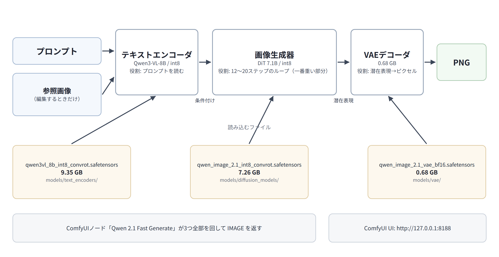

**English → [TECHNICAL.en.md](TECHNICAL.en.md)**

**通常の導入・使い方 → [README.md](README.md)**

# 技術リファレンス — Qwen-Image-2.1 / ComfyUI

このファイルは、通常利用のREADMEから分離した技術詳細です。内部構成、モデルファイル、ノード実装、実測値、トラブルシューティング、手動導入、開発情報をまとめています。AIエージェントに環境を調査・修正・拡張させる場合も、まずこのファイルを渡すと必要な背景をまとめて読ませられます。

<details>
<summary>技術資料の目次を開く</summary>

- [4. 何が動いているのか](#4-何が動いているのか)
  - [4-1. 重み（モデルファイル）の中身とダウンロード先](#4-1-重みモデルファイルの中身とダウンロード先)
  - [4-2. それぞれの役割](#4-2-それぞれの役割)
  - [4-3. 使っているモデルの正式名称（量子化方式まで）](#4-3-使っているモデルの正式名称量子化方式まで)
  - [4-4. 参照画像を使った編集（このノードでは4枚まで）](#4-4-参照画像を使った編集このノードでは4枚まで)
- [5. ノードの中身](#5-ノードの中身)
- [6. 実測値](#6-実測値)
- [7. 品質を上げたいとき](#7-品質を上げたいとき)
- [8. トラブルシューティング](#8-トラブルシューティング)
- [9. 落とし穴（全部実際に踏みました）](#9-落とし穴全部実際に踏みました)
- [10. 手動インストールと設定](#10-手動インストールと設定)
- [11. 開発・カスタマイズ](#11-開発カスタマイズ)
- [12. ファイル構成](#12-ファイル構成)
- [13. ライセンス](#13-ライセンス)
- [14. 出典](#14-出典)

</details>

## 4. 何が動いているのか



*プロンプトと参照画像が、テキストエンコーダ → 画像生成器 → VAE → PNG の順に流れます。*

### 4-1. 重み（モデルファイル）の中身とダウンロード先

> [!TIP]
> **このダウンロードを自分でやる必要はありません。** [READMEのクイックスタート](README.md#1-クイックスタート)の
> `install.sh` が自動でやってくれます（それが一番早いです）。ここは「何を落とすのか」を確認したい人と、
> 手動でやりたい人向けの説明です。

必要なファイルは3つ、合計約17GBです。`hf` コマンドで落とします。
`hf` の導入方法は[公式ガイド](https://huggingface.co/docs/huggingface_hub/installation#install-the-hugging-face-cli)を参照してください。

```bash
hf download Comfy-Org/Qwen-Image-2.1 diffusion_models/qwen_image_2.1_int8_convrot.safetensors --local-dir ~/qwen-image-2.1-models
hf download Comfy-Org/Qwen-Image-2.1 text_encoders/qwen3vl_8b_int8_convrot.safetensors       --local-dir ~/qwen-image-2.1-models
hf download Comfy-Org/Qwen-Image-2.1 vae/qwen_image_2.1_vae_bf16.safetensors                 --local-dir ~/qwen-image-2.1-models
```

ブラウザや `curl -L -O` で落としたい場合は、この3つの直リンクです。

| 用途 | サイズ | ダウンロードリンク |
|---|---:|---|
| 画像生成器 | 7.26 GB | <https://huggingface.co/Comfy-Org/Qwen-Image-2.1/resolve/main/diffusion_models/qwen_image_2.1_int8_convrot.safetensors> |
| テキストエンコーダ | 9.35 GB | <https://huggingface.co/Comfy-Org/Qwen-Image-2.1/resolve/main/text_encoders/qwen3vl_8b_int8_convrot.safetensors> |
| VAE | 0.68 GB | <https://huggingface.co/Comfy-Org/Qwen-Image-2.1/resolve/main/vae/qwen_image_2.1_vae_bf16.safetensors> |

落としたファイルは、ComfyUIの次の場所に置きます（ファイル名は変えません）。

| ファイル | 置き場所 |
|---|---|
| `qwen_image_2.1_int8_convrot.safetensors` | `ComfyUI/models/diffusion_models/` |
| `qwen3vl_8b_int8_convrot.safetensors` | `ComfyUI/models/text_encoders/` |
| `qwen_image_2.1_vae_bf16.safetensors` | `ComfyUI/models/vae/` |

（`install.sh` を使う場合は、この2つを自動でやってくれます。→ [READMEの1. クイックスタート](README.md#1-クイックスタート)）

### 4-2. それぞれの役割

登場するのは5つです。このリポジトリが提供するのは**下の2つ**で、上は素のComfyUIと素のモデルファイルです。

| 部品 | 正体 | 役割 | 置き場所 |
|---|---|---|---|
| テキストエンコーダ | Qwen3-VL-8B（9.35 GB） | プロンプトを「読む」係。参照画像もここで視覚情報として読み取られる | `ComfyUI/models/text_encoders/` |
| 画像生成器 | DiT 7.1B（7.26 GB） | 実際に「描く」係。ノイズから絵を作るループ（12〜20ステップ）を回す。**一番時間がかかる部分** | `ComfyUI/models/diffusion_models/` |
| VAE | デコーダ（0.68 GB） | 途中のデータ（潜在表現）を、見える画像（ピクセル）に変換する | `ComfyUI/models/vae/` |
| 自作ノード | `custom_nodes/qwen21_fast/`（このリポジトリ） | 上の3つを読み込み、ループを回し、画像を返す。ComfyUIの画面上では1つの箱になる | `ComfyUI/custom_nodes/` |
| ワークフロー | `workflows/*.json`（このリポジトリ） | 「ノード＋画像保存」だけの、開いてすぐ使える図 | `ComfyUI/user/default/workflows/` |

**なぜ3ファイルも要るのか**: Qwen-Image-2.1は「1個のファイル」では配布されていません。絵を描く本体（画像生成器）と、
プロンプトを読む別のモデル（テキストエンコーダ、8Bの視覚言語モデル）と、画像に戻すためのVAEが別々に必要です。
VAEは旧Qwen-ImageやWanのものと**互換性がありません**（取り違えるとエラーになります）。

**なぜノードを作ったのか**: ComfyUIで手作業でも組めます（`UNETLoader → CLIPLoader → TextEncodeQwenImage21 →
KSampler → VAEDecode`）。ただし設定したい項目（サイズ、ステップ数、参照画像の扱い）が4つの箱に散らばるので、
私が普段使う設定をまとめて1つの箱にしました。中身はComfyUI標準のノードの組み合わせなので、
ComfyUIが更新されてもそのまま動きます。

### 4-3. 使っているモデルの正式名称（量子化方式まで）

私が使っているのは、**Qwenが配布している本家そのものではなく、ComfyUI用に変換・量子化された配布物**です。

| 部品 | 正式名称 | 量子化方式 |
|---|---|---|
| 画像生成器 | **Qwen-Image-2.1**（配布: Comfy-Org） | **int8 tensorwise + convrot**（重みを回転させてから8bit化する方式。精度の劣化を抑えつつ速い） |
| テキストエンコーダ | **Qwen3-VL-8B-Instruct** | **int8 convrot** |
| VAE | **Qwen-Image-2.1 VAE** | 量子化なし（**bf16**） |

- 元の本家配布（bf16・量子化なし）は約33GBで、12GBのVRAMには載りません。量子化版を使い、必要な部分をComfyUIに入れ替えさせて12GB環境で動かしています。
- 本家とComfyUI形式の置き場: <https://huggingface.co/Qwen/Qwen-Image-2.1> ／
  <https://huggingface.co/Comfy-Org/Qwen-Image-2.1>
- **ライセンスは必ず自分で確認してください。** 私が見たときは研究・非商用向けの「Qwen Research License」でしたが、
  条件は変わりうるので、使う前に原文を確認してください（商用利用を考えている場合は特に）。
  - 原文: <https://github.com/QwenLM/Qwen-Image-2.1/blob/main/LICENSE>

### 4-4. 参照画像を使った編集（このノードでは4枚まで）

ノードには `image_1` 〜 `image_4` という入力があり、**このノードでは4枚まで**参照画像を渡せます。参照画像を
繋ぐと「テキストから生成」ではなく「参照画像を編集する」モードになります（例: 「この写真の背景を夜にして、
被写体はそのまま」）。

> [!NOTE]
> **「4枚」はこのノードの入力スロットの数であって、モデルの上限ではありません。** Qwen-Image-2.1は公式に
> **最大10枚**の参照画像に対応しています（ComfyUI標準の `TextEncodeQwenImage21` ノードはもっと多くの
> スロットを持っています）。5枚以上使いたい場合は、このノードの `image_*` を増やすか、標準ノードで組んでください。

**増やすと、少しずつ時間が伸びます**（1024x1024・12ステップでの私の実測）:

| 参照画像の枚数 | 時間 |
|---|---:|
| 1枚 | 17.0 秒 |
| 2枚 | 25.9 秒 |
| 3枚 | 36.4 秒 |

理由は、参照画像1枚につき約4096トークンぶんの情報がテキストエンコーダと画像生成器に追加されるためです。
1枚増えるごとに+9〜10秒くらいを見ておけば大丈夫です。`reference_fit` は参照画像の扱いで、
`keep original size` は参照を縮小せずそのまま使います。軽くなるのは**参照が出力より小さいとき
だけ**です（`match output` は参照を出力の面積まで縮めるため）。参照が出力より大きいときは逆に
重くなります（大きい写真をそのまま読ませることになるため）。1024x1024の参照ではどちらもほぼ
同じです（実測 15.9秒 vs 16.7秒）。

同梱の2つの画像編集ワークフローは、`install.sh` が `ComfyUI/input/qwen21_demo_source.png` に置く元画像を読み込みます。自分の画像を使うときは、LoadImageノードで選び直してください。

## 5. ノードの中身

| 入出力 | 名前 | 意味 |
|---|---|---|
| 入力 | `prompt` | テキストから生成するときは描きたいもの、編集するときは変える部分と残す部分を書きます |
| 入力 | `aspect_ratio` × `megapixels` | 縦横比（1:1 / 4:3 / 3:4 / 3:2 / 2:3 / 16:9 / 9:16）と大きさ（0.5 / 1 / 2 / 4 MP）。**1MP＝1024x1024、4MP＝2048x2048**。参照画像を繋いだときは `aspect_ratio` は効きません（縦横比は参照画像に従います）。このとき `megapixels` が決めるのは**面積**です（例: 16:9の参照で `megapixels=2` → 1920x1088。長辺が1440になるのではなく、1440x1440とほぼ同じ面積になります） |
| 入力 | `steps` | 0＝自動（**長辺が1024px以下なら12ステップ**、それより大きければ20。1:1の1MPは12、4:3・16:9の1MPは長辺が1184・1376pxなので20になります）。編集モードでも判定は `aspect_ratio`×`megapixels` の値で行うので、参照画像由来の実際の出力（例: 1376x768）ではなく widget の長辺で決まります |
| 入力 | `seed` | 乱数の種。テキスト生成と `qwen21_fast_edit` は `randomize` で毎回違う絵を出します。`qwen21_fast_edit_underwater_fixed` だけは水中の例を再現しやすいよう `fixed`（`274968494187645`）です |
| 入力 | `count` | 一度に何枚作るか（seed, seed+1, …）。結果はまとめて返ります |
| 入力 | `reference_fit` | 参照画像の扱い（`match output`＝出力サイズに合わせる／`keep original size`＝参照の元サイズのまま。後者が軽くなるのは参照が出力より**小さい**ときだけ。参照が大きいときは `match output` のほうが軽い〔実測15.9秒 vs 16.7秒〕） |
| 入力 | `unet_name` / `clip_name` / `vae_name` | 重み3ファイルの指定（既定は上の3つ） |
| 入力（任意） | `image_1` 〜 `image_4` | 参照画像。1枚でも繋ぐと編集モードになります（4枚はこのノードのスロット数の話で、モデルの上限ではありません） |
| 入力（任意） | `model` / `clip` / `vae` | すでにグラフにローダがある場合はそれを使い回せます |
| 出力 | `image` | 生成された画像（IMAGE） |
| 出力 | `info` | 設定と所要時間の1行（実例: `t2i refs=0 1024x1024 12 steps cfg=1.0 euler/simple seeds=0..0 13.2s (13.2s each)`）。編集モードでは**実際の出力サイズ**（参照画像の縦横比に従う）が出ます |

**cfg（プロンプトへの従い具合）とサンプラーは、あえて表に出していません。** このモデルは cfg 1.0 と
euler/simple が公式の設定で、それ以外にすると遅くなるだけで良いことがないためです（→ [9. 落とし穴](#9-落とし穴全部実際に踏みました)）。
ネガティブプロンプトの欄もありません。cfg 1.0 のとき、ComfyUIはネガティブ側の計算を**しない**仕様
（`comfy/samplers.py` は `math.isclose(cond_scale, 1.0)` のとき無条件パスを丸ごと省略します）なので、入力しても何も起きないからです。

## 6. 実測値

私の環境（RTX 4070 12GB・公式の量子化済み重み）での数字です。同じプロンプト・同じseedで比較しています。

| ケース | 時間 |
|---|---:|
| 1024x1024・12ステップ・cfg 1.0 | **9.6 秒**（ComfyUI再起動直後は13〜14秒） |
| 1024x1024・25ステップ（公式ワークフロー相当） | 14.0 秒 |
| 1920x1088（16:9・2MP）・20ステップ | 30.7 秒 |
| **2048x2048（4MP）・20ステップ** | **90.5 秒** |
| 1024x1024を3枚まとめて（`count=3`） | 24.2 秒（1枚あたり約8秒） |
| 参照画像1枚で編集（1024x1024・12ステップ） | 17.0 秒 |
| 参照画像3枚で編集 | 36.4 秒 |

- 1ステップあたり: 1MPで約0.34秒、4MPで約4.3秒
- 固定費（テキストの読み取り・VAEのデコード・モデルの入れ替え）が約5秒
- 重み17GBは12GBのVRAMに載りきらないので、ComfyUIが自動で必要な部分を入れ替えます。だから再起動直後だけ
  数秒余分にかかり、`count=3` は3回別々に走らせるより1枚あたり安くなります
- 測った生のログ: `MEASUREMENTS.md`

## 7. 品質を上げたいとき

- **ステップ数を増やす**（`steps` を 0 → 20〜30 にする）。時間はステップ数にほぼ比例して伸びます（1MPで1ステップ約0.34秒＋固定費が約5秒。12→25ステップなら×1.5）。
  12ステップでも十分きれいですが、細部や文字は増やすほど安定します
- **解像度を上げる**（`megapixels` を 1 → 4 に）。構図が破綻しにくく細部も増えますが、時間は約9倍（9.6→90.5秒、既定ステップ）になります
- **seedを変えて選ぶ**。`count` を 3〜4 にすると一度に何枚も出せるので、選ぶのが楽です（1枚あたりは少し安くなります）
- **参照画像の解像度を上げる／`reference_fit` を `match output` にする**。編集の再現度が上がります
- **プロンプトを丁寧に書く**。「〜をそのまま」「背景だけ〜」のように、変えたい所と残したい所を分けて書くと効きます
- **cfgは触らない**（1.0のまま）。上げると時間が2倍になるだけで、絵はコントラスト過多になります
- 公式はプロンプト書き換え用のモデル（`Qwen-Image-2.1-PE-T2I`）も配布しています。未検証ですが、
  短いプロンプトを詳細化して品質を上げられるそうです

変えたときの影響の目安:

| 変えるもの | 時間 | VRAM | 品質 |
|---|---|---|---|
| ステップ 12 → 25 | ×1.5（9.6→14.0秒。固定費が大きいので倍にはならない） | ほぼ同じ | 少し上がる |
| 解像度 1MP → 4MP | ×9.4（9.6→90.5秒。既定ステップの比較。12ステップ固定なら56.2秒で×5.9） | 増える | 上がる（構図が安定） |
| 参照画像 +1枚 | +9〜10秒 | 増える | 編集の再現度が上がる |
| cfg 1.0 → 6.0 | ×2 | 増える | 下がる（濃すぎる絵になる） |

## 8. トラブルシューティング

| 症状 | 原因 | 対処 |
|---|---|---|
| `mat1 and mat2 shapes cannot be multiplied (… x4096 and 1024x2048)` というエラー | 別のワークフローのエンコーダ（0.6Bや4Bのもの）をCLIPLoaderが読んでいる | `qwen3vl_8b_int8_convrot.safetensors` を type `qwen_image` で読む |
| ノード一覧に「Qwen 2.1 Fast Generate」が出てこない | カスタムノードは起動時にしか読まれない／置き場所が違う | ComfyUIを再起動する。`custom_nodes/qwen21_fast/nodes.py` があるか確認 |
| VAELoaderで `size mismatch for encoder.conv_in.weight` | unsloth FP8リポジトリのVAEは**diffusersレイアウト**（2D畳み込み、`encoder.conv_in` / `decoder.conv_out`）。ComfyUIのQwen-Image-2.1は**modelspecレイアウト**（3D畳み込み、`encoder.conv1` / `decoder.head.2`）を期待する | Comfy-Orgの `qwen_image_2.1_vae_bf16.safetensors`（675,509,688バイト）を使う |
| 上の実測より2倍くらい遅い | cfgが1.0より大きい／GGUFの重みを使っている | cfg 1.0、int8_convrotの重みにする |
| 同じ内容を実行したら0.1秒で終わった | ComfyUIが同一のグラフをキャッシュしている（正常動作） | 時間を測るときはseedを変える |
| `aimdo memory compile error` | `QwenImage21Cache`（prefix KVキャッシュ）のint8/int4がこの環境では動かない | `default` のまま使う（ノードは公開していません） |
| 参照画像3〜4枚で失敗する／遅すぎる | 参照1枚で約4096トークン消費するため | 枚数を減らす／`megapixels` を下げる／参照を先に縮小してから入力する（大きい参照＋`keep original size` が最も重い） |
| GGUFのローダで "unknown model architecture" | このモデルのGGUF再パックはメタデータが欠落している | ここではGGUFを使わず、int8_convrotのsafetensorsを使う |

## 9. 落とし穴（全部実際に踏みました）

1. **cfgを1.0より上げると計算が2倍**。公式設定は1.0です。世の中のサンプルコードは6.0などが多く、これが最大の罠でした。
2. **GGUFの再パックはComfyUIでは遅い**。unslothの**DiT GGUFはアーキテクチャ情報を持たず**（`kv_count=0`）、
   ComfyUI-GGUFは推測経路に落ちて `Unknown model architecture!` になります（`tools/convert.py` に `qwen_image`
   のシグネチャを足せば読めます）。読ませたうえで同一プロンプト・同一seed・各6回で測ると、1024x1024/12ステップは
   **int8 11.8秒 対 GGUF 24.3秒（中央値＝約2.0倍）**、サンプラー自身の進捗では **0.52 対 1.38 秒/step（約2.6倍）**
   でした。ComfyUIがint8カーネルを使えず毎回展開するためで、両者共通の固定費（約6秒）が12ステップでは比率を
   薄めます。※**テキストエンコーダのGGUFは正しいメタデータ**（`general.architecture=qwen3vl`、kv 45件）を持っており、
   こちらが原因ではありません（DiT側の話です）。
   参考: **ベンダー自身のアプリ（Unsloth Desktop）でも同じGGUFを実測**しました。12GBではint8経路が選べず
   （全部を常駐させる必要があり34.9GB要求・しかもオフロード不可）、GGUFのみで**29.5秒**でした
   （[MEASUREMENTS.md](MEASUREMENTS.md) の 3-2）。
3. **VAEは2種類あり、中身のレイアウトが違う**。どちらも**4チャンネル（アルファ対応）**で、違いは形です。
   Comfy-Org版は**modelspecレイアウト**（3D畳み込み、`encoder.conv1` / `decoder.head.2`、カーネル`[1,3,3]`）、
   unsloth FP8リポジトリ内のものは**diffusersレイアウト**（2D畳み込み、`encoder.conv_in` / `decoder.conv_out`、
   カーネル`[3,3]`）。ComfyUIが期待するのは前者なので、後者を選ぶと `size mismatch` の山になります
   （3チャンネルのQwen VAEは**Qwen-Image 1.0**のもので、別モデルなので使えません）。
4. **ComfyUIは同じグラフをキャッシュする**。同じプロンプトとseedだと0.1秒で返り、GPUは動きません。
5. **`QwenImage21Cache`（prefix KVキャッシュの量子化）はこの環境で動きません**。int8もint4も
   `aimdo memory compile error` で落ちるので、ノードには入れていません。
6. **エンコーダは必ずQwen-Image-2.1用を使う**。サイズ違いのQwen3-VLを使うと、分かりやすいエラーではなく
   cross-attentionのshapeエラーになります。

## 10. 手動インストールと設定

### 10-1. インストールスクリプトの詳細

既存のComfyUIに対して `./install.sh` を実行すると、次の5つを行います。

1. 公式リポジトリから**重み3ファイル**を `$MODELS`（既定 `~/qwen-image-2.1-models`）にダウンロード（約17GB・途中再開可）
2. それをComfyUIの3つのフォルダに配置。同一ファイルシステムなら**ハードリンク**するので追加容量はほぼ不要です。別ファイルシステムではコピーにフォールバックするため、その場合はComfyUI側にも同容量が必要です
3. `custom_nodes/qwen21_fast` を `$COMFY/custom_nodes/` にコピー（＝ノードの設置）
4. `workflows/*.json` を `$COMFY/user/default/workflows/` に、デモの元画像を `$COMFY/input/` にコピー（開いてすぐ編集を試せるように）
5. ComfyUIを再起動（`systemd --user` のサービスを見つけて再起動します。見つからなければ何もしないので、
   いつもの方法で再起動してください。**カスタムノードは起動時にしか読み込まれません**）

`--with-comfyui` を付けた場合は、その前に[ComfyUI本体](https://github.com/Comfy-Org/ComfyUI)を取得し、
専用のPython仮想環境、NVIDIA向けPyTorch、ComfyUIの依存パッケージ、`hf` CLIを入れます。
その後に上の1〜4を実行します。新規導入ではサービスの自動再起動はせず、起動コマンドを表示します。
`--dry-run` は実行予定の表示だけで、フォルダを作成しません。

パスを変えたいときは、コマンドの前に付けます。

```bash
COMFY=/opt/ComfyUI MODELS=/data/qwen21-models ./install.sh
COMFY_SERVICE=my-comfy.service ./install.sh     # 再起動するサービス名を指定する場合
```

### 10-2. 手作業で入れる

<details>
<summary>スクリプトを使わず、自分の手で入れる手順（クリックで開く）</summary>

**B1. 重みを落とす** — [4-1](#4-1-重みモデルファイルの中身とダウンロード先) の3コマンドを実行します。

**B2. 所定の場所に置く**（ファイル名は変えないでください）

```bash
C=~/ComfyUI          # あなたのComfyUIのフォルダ
mv ~/qwen-image-2.1-models/diffusion_models/qwen_image_2.1_int8_convrot.safetensors $C/models/diffusion_models/
mv ~/qwen-image-2.1-models/text_encoders/qwen3vl_8b_int8_convrot.safetensors        $C/models/text_encoders/
mv ~/qwen-image-2.1-models/vae/qwen_image_2.1_vae_bf16.safetensors                  $C/models/vae/
```

**B3. ノードとデモを入れる** — このリポジトリをcloneして、ノード・ワークフロー・元画像をコピーします。

```bash
git clone https://github.com/kuraneko1/qwen21-fast-comfyui.git /tmp/qwen21-fast-comfyui
cp -r /tmp/qwen21-fast-comfyui/custom_nodes/qwen21_fast ~/ComfyUI/custom_nodes/
mkdir -p ~/ComfyUI/user/default/workflows ~/ComfyUI/input
cp /tmp/qwen21-fast-comfyui/workflows/*.json ~/ComfyUI/user/default/workflows/
cp /tmp/qwen21-fast-comfyui/docs/demo/source.png ~/ComfyUI/input/qwen21_demo_source.png
```

（このリポジトリを `custom_nodes/` の中に直接cloneしてもOKです。その場合もワークフローと元画像は上の場所へコピーしてください）

**B4. ComfyUIを再起動** — 動いているComfyUIは新しいノードに気づきません。必ず再起動してください。

**B5. 実行** — ComfyUIを起動し、ブラウザでそのURL（[10-5](#10-5-ポートと接続先) 参照）を開いて、
**Workflows → `qwen21_fast_t2i`** を選ぶか、自分で次の2ノードを組んでください。

```
Qwen 2.1 Fast Generate ──image──▶ SaveImage
```

参照画像で編集したいときは、`LoadImage` を足してノードの `image_1` に繋ぎます。

```
LoadImage ──IMAGE──▶ image_1
```

</details>

### 10-3. OS別の注意

> [!WARNING]
> **このリポジトリはLinux前提です。** 私が確認したのは Ubuntu 24.04 です。`install.sh` はbashスクリプトで、
> コマンドもパスの書き方もLinuxの前提で書いてあります。
>
> **Windowsの場合は、次のどちらかが必要です。**
>
> 1. **WSL2を使う（おすすめ）**: Windowsの中にUbuntuを入れて、その中でこの手順をそのまま実行します。
>    ComfyUIもWSL側に入れることになります（Windows側に入れたComfyUIとは別物です）。
> 2. **手作業にする**: Windows版ComfyUIに、重み3ファイルをエクスプローラで
>    `ComfyUI\models\...` に置き、`custom_nodes` にノードのフォルダをコピーします
>    （[10-2. 手作業で入れる](#10-2-手作業で入れる) の内容を、Windowsのパスに読み替えて行います）。
>    `~/ComfyUI` や `mv`、`ln` といったLinuxのコマンドは使えないので注意してください。
>
> macOSも、このままのコマンドでは動きません（`hf` とpythonは同じですが、パスや再起動の方法が違います）。

### 10-4. 環境変数

| 変数 | 既定値 | 使うスクリプト |
|---|---|---|
| `COMFY` | `$HOME/ComfyUI` | `install.sh`（ComfyUIの場所） |
| `MODELS` | `$HOME/qwen-image-2.1-models` | `install.sh`（重みのダウンロード先） |
| `COMFY_SERVICE` | 既存ComfyUIでは "comfy" を含む `systemd --user` のサービスを自動検出 | `install.sh` |
| `HF_CLI` | ComfyUIの仮想環境内か、PATH上の `hf` | `install.sh`（CLIを指定したい場合） |
| `COMFY_DIR` | `$HOME/ComfyUI` | `test_qwen21.py` / `test_qwen21_edit.py` / `make_qwen21_workflows.py` / `check.sh` |
| `COMFY_HOST` | `http://127.0.0.1:8188` | `test_qwen21.py` / `test_qwen21_edit.py` / `make_qwen21_workflows.py` |
| `CHROME` | `/usr/bin/google-chrome` | `docs/capture_ui.py` / `docs/render_diagram.sh`（画像を作り直すときだけ） |

パスやホスト名、デバイスIDや認証情報などは、コードに直接書いていません（ComfyUIの場所・URL、サービス名、ブラウザのパスは上の環境変数から取ります）。

### 10-5. ポートと接続先

ComfyUIは既定で **`http://127.0.0.1:8188`** で待ち受けます。**ブラウザでこのURLを開くだけ**でUIが出ます
（`127.0.0.1` は「今使っているPC自身」という意味なので、同じPCのブラウザで開きます）。

```
ComfyUI UI      http://127.0.0.1:8188     ← ブラウザで開く
                ├── ノード一覧の「Qwen 2.1 Fast Generate」
                ├── ワークフロー: Workflows ▸ qwen21_fast_t2i / qwen21_fast_edit / qwen21_fast_edit_underwater_fixed
                └── スクリプトが使うAPI: http://127.0.0.1:8188/prompt, /history, /object_info
```

テキストから生成するワークフローを開くと、こうなります。


*このノードと「画像を保存」をつないだだけの図です。*

実行（Run）を押すと、右の「画像を保存」ノードの中に生成結果が出ます（下は1024x1024・12ステップの実行直後）。
**seed は既定でランダム**（`control after generate` = randomize。ノード側で有効にしています）なので、押すたびに違う絵になります。
同じ絵を再現したいときは `fixed` に切り替えて、seedの値を控えておいてください。


起動コマンドの形はこれです（私の環境の例）。

```bash
python main.py --port 8188 --listen 127.0.0.1
```

**ポートを変えたいとき**は、次のどれかです。

| 方法 | やり方 |
|---|---|
| 起動コマンドで指定 | `python main.py --port 8288 --listen 127.0.0.1`（`--port` の数字を変えるだけ） |
| systemdで動かしている場合 | unitファイルの `ExecStart=` の `--port` を書き換えて `systemctl --user restart <サービス名>`（私は `~/.config/systemd/user/` の中のunitに書いています） |
| 他のPC・スマホから開きたい | `--listen 0.0.0.0` にする（同じLANの全員から見えるので注意） |
| 検証スクリプト側 | ポートを変えたら `COMFY_HOST=http://127.0.0.1:8288 python3 test_qwen21.py` のように渡す |

## 11. 開発・カスタマイズ

### 11-1. ノードはAIに作らせることもできる

**このノードは、私がAI（エージェント）に作らせたものです。** コードは私が書いていません。同じように頼めば、
あなたの環境に合わせたノードをAIに作らせられます。コツは次の3つです。

1. **「ComfyUIのカスタムノードを作って」と、やりたいことを普通の日本語で頼む**
   （例:「プロンプトと参照画像を入れると画像を返す、設定済みのノードがほしい」）
2. **既存のノードの組み合わせで作らせる**（今回もそうしました）。ComfyUI本体のモデル実装を再発明させると、
   本体が更新されたときに壊れます。「ComfyUI標準のノード（`UNETLoader` など）を内部で呼ぶ形にして」と伝えると安全です
3. **実機で生成テストまでやらせる**（`test_qwen21.py` のような検証スクリプトも一緒に作らせると、
   あとで自分で壊していないか確認できます）

このリポジトリの `custom_nodes/qwen21_fast/nodes.py` は170行ほどです。改造したいときは、このファイルをAIに渡して
「ここをこう変えて」と頼むのが早いです。

## 12. ファイル構成

```
install.sh                       ComfyUIの新規導入（任意）・重み・ノード・ワークフローの設置
check.sh                         構文チェック（bash / python / ワークフローJSON）
MEASUREMENTS.md                  実測値の生ログ
custom_nodes/qwen21_fast/        ノード本体（ComfyUI標準ノードの組み合わせ）
workflows/qwen21_fast_t2i.json   プロンプトから生成するワークフロー
workflows/qwen21_fast_edit.json  元画像から水中へ編集（seedはランダム）
workflows/qwen21_fast_edit_underwater_fixed.json  元画像から水中へ編集（seed固定）
make_qwen21_workflows.py         ノードの仕様からワークフローを作り直す
test_qwen21.py                   検証（サイズ・枚数・編集）
test_qwen21_edit.py              コマンドラインからの単発編集
docs/collage_ja.png              冒頭のコラージュ（元画像＋3シーン）
docs/pipeline_ja.png             §4の構成図（HTMLから生成したPNG）
docs/ui_workflow_ja.png          ワークフローを開いた画面
docs/ui_used_ja.png              実行して結果が出ている画面（ノードを実際に使っている状態）
docs/demo/source.png             編集デモの元画像（インストール時にComfyUIへコピー）
docs/demo/fire.png / underwater.png / rain.png   編集結果と同名のプロンプト.txt
docs/demo/edit_workflow_ja.png   元画像から水中の結果を出した画面
docs/demo/text_to_image.png      テキストから実際に生成した画像
docs/demo/generation.gif / .mp4  生成中の画面（アニメーションと動画）
docs/demo/open_workflow_ja.gif / .mp4  ワークフロー選択から実行までの短い動画
docs/diagram.html / .en.html     概念図の元データ（HTML。日本語版と英語版）
docs/render_diagram.sh           概念図をPNGに書き出す（ヘッドレスChrome・2倍解像度）
docs/diagram-spec.md             概念図の設計書（何を描くかの指定のみ。デザイン指定なし）
docs/capture_ui.py               スクリーンショットを撮るスクリプト
```

概念図とUIスクリーンショットは生成物です。概念図は `./docs/render_diagram.sh` でHTMLから描き直せます（Chromeのヘッドレス実行）。
スクリーンショットは `python3 docs/capture_ui.py docs --lang ja --run` で、起動中のComfyUIにワークフローを
読み込ませて撮ります（`ui_empty_ja.png`＝開いた直後、`ui_workflow_ja.png`＝ワークフロー読込後、`--run` を
付けると実際に1枚生成して `ui_used_ja.png` も撮ります。`--lang en` で英語UI版）。編集デモの画面も
`--workflow qwen21_fast_edit_underwater_fixed --run` で撮影しました。

## 13. ライセンス

このノードとスクリプトは MIT です。**重み（モデルファイル）はこのリポジトリに含まれていません** — `install.sh`
が下の公式リポジトリからダウンロードし、重みはそれぞれのライセンスに従います。

**重みのライセンスは必ず自分で確認してください。** 私が見たときは研究・非商用向けの条件でしたが、内容は
変わりうるので、原文が唯一の根拠です:
<https://github.com/QwenLM/Qwen-Image-2.1/blob/main/LICENSE>

## 14. 出典

| ファイル | サイズ | 直リンク |
|---|---:|---|
| 画像生成器（int8 convrot） | 7.26 GB | <https://huggingface.co/Comfy-Org/Qwen-Image-2.1/resolve/main/diffusion_models/qwen_image_2.1_int8_convrot.safetensors> |
| テキストエンコーダ（int8 convrot） | 9.35 GB | <https://huggingface.co/Comfy-Org/Qwen-Image-2.1/resolve/main/text_encoders/qwen3vl_8b_int8_convrot.safetensors> |
| VAE（bf16） | 0.68 GB | <https://huggingface.co/Comfy-Org/Qwen-Image-2.1/resolve/main/vae/qwen_image_2.1_vae_bf16.safetensors> |

同じリポジトリには、量子化なしの `qwen_image_2.1_bf16.safetensors`（14.2 GB）、
`qwen3vl_8b_bf16.safetensors`（17.5 GB）、`qwen3vl_8b_w4a8.safetensors`（6.3 GB）、
プロンプト書き換え用の `qwen3.5_9b_qwen_image_2.1_pe_t2i` / `..._pe_i2i`（各9.5 GB）もあります。

- モデルカード（本家）: <https://huggingface.co/Qwen/Qwen-Image-2.1>
- コードとライセンス: <https://github.com/QwenLM/Qwen-Image-2.1>
- ComfyUI形式の配布: <https://huggingface.co/Comfy-Org/Qwen-Image-2.1>
- GGUF再パック（この手順では使いません）: <https://huggingface.co/unsloth/Qwen-Image-2.1-GGUF> ·
  <https://huggingface.co/leejet/Qwen-Image-2.1-GGUF>
- 公式ComfyUIワークフロー: <https://github.com/Comfy-Org/workflow_templates>
